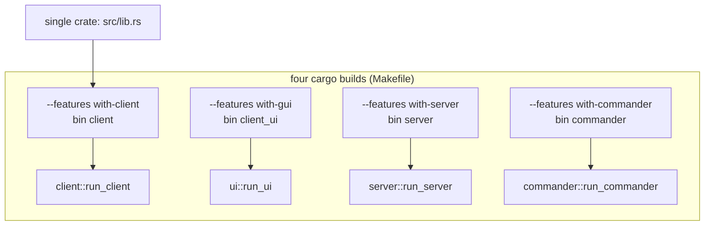
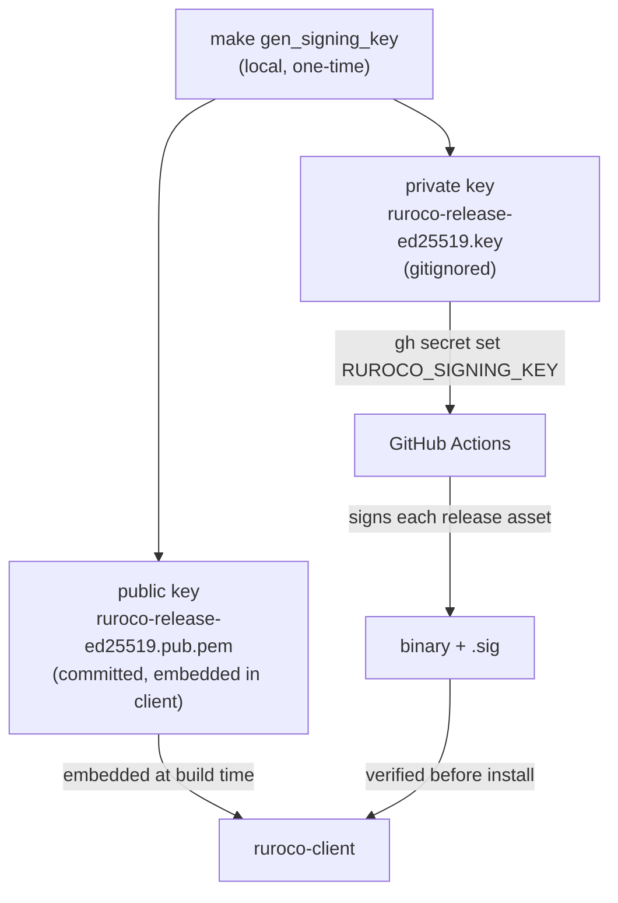
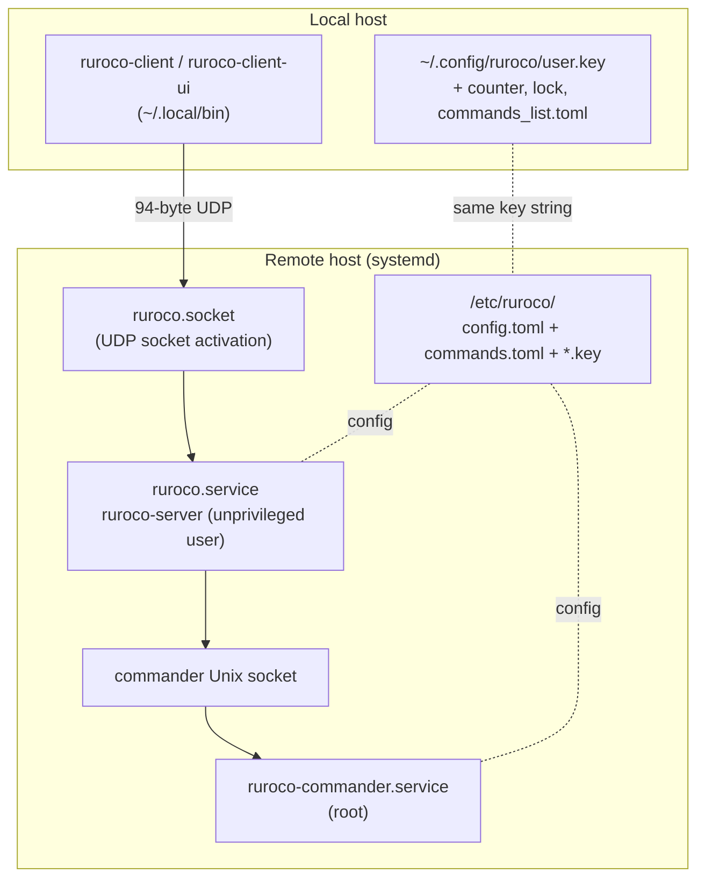

# Build, Features and Deployment

This chapter covers how the one source tree becomes four binaries, how the Cargo features carve it
up, and how it is deployed and operated on a server. It is the bridge between "how the code is
structured" and "how it runs in production".

## Cargo features

`Cargo.toml` defines the feature set that decides which modules and dependencies compile.

| Feature | Pulls in | Enables |
| --- | --- | --- |
| `with-client` | `ureq`, `tempfile`, `openssl` | the `client` module (send, gen, update, wizard, counter, lock) |
| `with-commander` | `toml` | the `commander` module (no OpenSSL, no UDP/decrypt) |
| `with-server` | `openssl`, **+ `with-commander`** | the `server` module (network-facing daemon) |
| `with-gui` | `eframe`, `toml`, **+ `with-client`** | the `ui` module |
| `android-build` | `jni`, `ndk-context`, `android-activity`, `wgpu`, **+ `with-gui`** | Android GUI backend |
| `with-vendored-openssl` | `openssl/vendored` | static OpenSSL for portable release binaries |

`default = []`: nothing is on by default, so each binary is built with `--no-default-features` plus
exactly the feature it needs. `common` always compiles. `openssl` is an optional dependency pulled
in only by `with-client` and `with-server`, so a `with-commander`-only build of the privileged
commander links no crypto/network code at all. This is why `make check` also runs
`cargo check --no-default-features`: to prove the shared code stands alone.

## Binary / feature / entry-point mapping

Each `[[bin]]` in `Cargo.toml` declares its `required-features`, so `cargo build` of one binary
cannot accidentally drag in another's feature.

## The Makefile workflow

The `Makefile` is the source of truth for commands. The ones you use most:

| Target | What it does |
| --- | --- |
| `make build` | builds all four binaries (debug, `x86_64-unknown-linux-gnu`), each with its own feature |
| `make test` | `cargo nextest` with all features and `TEST_UPDATER=1` (runs networked update tests) |
| `make test_unit` | tests excluding the integration binary |
| `make test_integration` | only the integration test (spins a real commander thread) |
| `make check` | `cargo check --locked` and `cargo check --locked --no-default-features` |
| `make format` | `cargo fmt`, then `clippy -D warnings`, then `cargo fix` |
| `make coverage` | `cargo tarpaulin` (llvm engine), xml + html output |
| `make release` | `release_android` + `release_linux` |
| `make release_linux` | release build of all binaries (client/server/ui add `with-vendored-openssl` for static OpenSSL; commander uses `with-commander`, no OpenSSL) |
| `make gen_signing_key` | generate the Ed25519 release signing keypair (one-time) |
| `make install_client` | build release, copy client binaries into `~/.local/bin` |
| `make install_server` | also copy server binaries to `/usr/local/bin`, then run the wizard |
| `make test_end_to_end` | full systemd + sudo end-to-end test (see `scripts/test_end_to_end.sh`) |

The release profile (`Cargo.toml`) is tuned for small, self-contained binaries: `opt-level = "z"`,
`lto = true`, `codegen-units = 1`, `strip = true`, `panic = "abort"`.

## Release signing

The private key never leaves CI; the public key ships inside the client. This is what makes
self-update trustworthy (see [Cryptography](./cryptography.md) and [client/update](../client/update.md)).

## Deployment topology

### Server setup via the wizard
`ruroco-client wizard` (run as root) provisions the server side: it force-updates the server
binaries, writes the three systemd units and `/etc/ruroco/config.toml` (mode `0o600`, only if
missing), then runs daemon-reload, enable, and start. The unit files and the default config are
embedded into the client at compile time with `include_bytes!` from the `systemd/` and `config/`
directories. Full detail in [wizard](../client/wizard.md).

### The systemd units
- **`ruroco.socket`**: holds the UDP listening socket and hands the file descriptor to the service
  (socket activation). The server reads it via `LISTEN_FDS`; if absent it falls back to binding
  `[::]` itself.
- **`ruroco.service`**: runs `ruroco-server` as the dedicated low-privilege `ruroco` user. Heavily
  sandboxed: it holds **no** capabilities (port 80 is bound by `ruroco.socket`, not the service),
  has its blocklist in a `StateDirectory` (`/var/lib/ruroco`) so `/etc/ruroco` stays fully
  read-only, and is restricted to `AF_UNIX` (correct only under socket activation — see the comments
  in the unit before changing the socket).
- **`ruroco-commander.service`**: runs `ruroco-commander` as root, owning the Unix socket (placed in
  a `RuntimeDirectory`, `/run/ruroco`). Because it is a generic root command runner whose
  restrictions are inherited by every command it spawns, its sandbox is deliberately looser: it
  keeps `CAP_CHOWN` (to chown the socket) plus `CAP_NET_ADMIN`/`CAP_NET_RAW` and INET/NETLINK
  address families so the documented `ufw` firewall commands still work. Tighten to `CAP_CHOWN` +
  `AF_UNIX` only if all your commands are `systemctl`/dbus-style (see the comments in the unit).

### Config files
- `/etc/ruroco/config.toml`: allowed `ips`, rate limit, clock skew, socket user/group, `config_dir`,
  and the optional `blocklist_dir` / `socket_dir` relocations (defaulting to `config_dir`). Read by
  both processes through their own views (`ConfigServer` reads the server fields, `ConfigCommander`
  the socket-ownership fields; `config_dir` and `socket_dir` overlap). Has **no** command map. The
  whole `/etc/ruroco` directory is mounted **read-only** for the server; its mutable state lives in
  `StateDirectory`/`RuntimeDirectory` instead. See [config and keys](../server/config-keys.md) and
  [Commander](../commander.md).
- `/etc/ruroco/commands.toml`: the `[commands]` map (name to shell string), `root`-owned `0600`.
  Read **only** by the commander, never by the network-facing server. See [Commander](../commander.md).
- `/etc/ruroco/*.key`: one or more shared keys. The server loads every `*.key` file; the packet's
  `key_id` selects which one. See [keys.rs](../server/config-keys.md).

## Local config layout (client)

The client keeps its state under the conf dir (`RUROCO_CONF_DIR`, else `$HOME/.config/ruroco`):

| File | Purpose |
| --- | --- |
| `*.key` | the shared key (also pass via `-k`) |
| `counter` | raw big-endian `u128` replay counter |
| `client.lock` | PID-based single-instance lock |
| `commands_list.toml` | the GUI's saved commands |

On Android these are kept in the app-private directory, and the AES key lives in SharedPreferences
rather than a file (see [Android integration](../ui/android.md)).

## Testing layers

- **Unit tests**: inline `#[cfg(test)]` modules next to the code.
- **Integration tests** (`tests/integration_test.rs`): spin a real commander thread and a server,
  send an actual packet, and assert the configured command runs and that replays are rejected.
- **End-to-end** (`scripts/test_end_to_end.sh`): exercises the real systemd units with sudo.

Tests isolate state with `tempfile::tempdir()` and `RUROCO_CONF_DIR`; update tests are gated behind
`TEST_UPDATER` because they hit a real (local) HTTP server. See the per-module chapters for the test
hooks each subsystem exposes.
