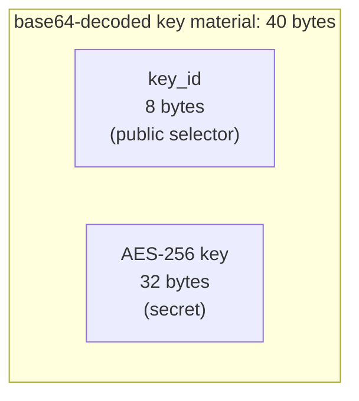
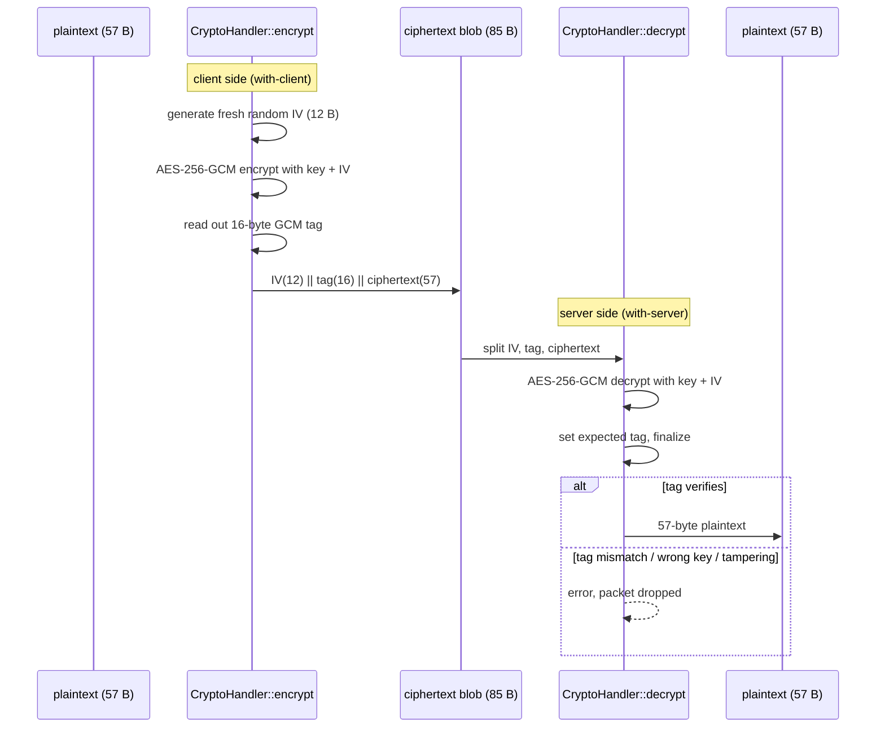

# Cryptography

Ruroco uses three primitives, each for one job. None of them is configurable or negotiated on the
wire, which removes a whole class of downgrade attacks.

| Primitive | Algorithm | Used for | Where |
| --- | --- | --- | --- |
| Symmetric encryption | AES-256-GCM (OpenSSL) | confidentiality + authenticity of the packet | `crypto/handler.rs`, `crypto/handler_ops.rs` |
| Hashing | Blake2b, 8-byte output | mapping command names to `cmd_hash` | `crypto/mod.rs::blake2b_u64` |
| Signatures | Ed25519 (OpenSSL) | verifying self-update binaries | `crypto/mod.rs::verify_ed25519` |

The file-level details are in [common/crypto](../common/crypto.md). This chapter is the conceptual
overview.

## The shared key

A ruroco key is a base64 string of **40 raw bytes**: an 8-byte `key_id` followed by a 32-byte
AES-256 key.

- Generated by `CryptoHandler::gen_key()` using OpenSSL `rand_bytes` for both halves
  (surfaced to the user as `ruroco-client gen` and the GUI's Generate button).
- The same string is placed on the client (used with `send`) and on the server (one or more
  `*.key` files in the config dir).
- `CryptoHandler` is `ZeroizeOnDrop`, and its `Debug` impl prints the key as `<redacted>`, so the
  secret never lands in logs or memory dumps after use.
- The `key_id` is sent in the clear so the server can pick the right key. Only the 32-byte key is
  secret.

## AES-256-GCM: how a packet is protected

GCM is an authenticated encryption mode: it provides confidentiality (the plaintext is hidden) and
integrity/authenticity (any tampering, or use of the wrong key, fails the tag check). The 57-byte
plaintext becomes an 85-byte blob:

Key properties enforced in code:

- **Fresh IV per packet.** `encrypt` generates a new random 12-byte IV every call, so encrypting
  the same plaintext twice yields different ciphertexts (a tested invariant). This is essential:
  reusing an IV with GCM is catastrophic.
- **Fail closed.** `decrypt` only returns plaintext if the GCM tag verifies. A wrong key, a
  flipped bit, or a truncated packet all produce an error and the packet is dropped. There is no
  partial decryption and no error is sent back to the client.
- **Exact sizes checked.** Both `encrypt` and `decrypt` assert the produced length equals
  `PLAINTEXT_SIZE` / `CIPHERTEXT_SIZE` and that GCM finalize emits no extra bytes.

The blob layout `IV || tag || ciphertext` is fixed and matched by both sides. The server splits it
in exactly that order in `decrypt`.

## Blake2b-64: hashing command names

`blake2b_u64(name) -> u64` produces an 8-byte Blake2b digest of a command name and interprets it
big-endian as a `u64`. This is the `cmd_hash` carried in the packet and the key the commander uses
to look commands up.

Why hash instead of sending the name:

- The client never transmits a command string, so a captured packet does not reveal what would
  run.
- Both sides compute the same hash from the same configured name, so they agree without ever
  exchanging the name over the wire.

Collision risk is acceptable here because the command set is tiny and operator-controlled; the
hash is an identifier, not a security boundary (the AES key is).

## Ed25519: trusting self-update binaries

The self-update path is the one place ruroco pulls executable code from the internet, so it is the
one place it verifies a signature.

- The release **private** key lives only in CI (the `RUROCO_SIGNING_KEY` GitHub Actions secret).
- The matching **public** key (`keys/ruroco-release-ed25519.pub.pem`) is committed and embedded
  into the client at build time.
- During `update`, the downloaded binary and its `.sig` are verified with
  `verify_ed25519(public_key_pem, message, signature)` **before** anything is written to disk. A
  missing or invalid signature aborts the update and leaves the existing binary untouched.

This means a compromised release host or a man-in-the-middle cannot push a malicious binary: it
would not carry a signature that validates against the embedded public key. Only releases that ship
signatures (`v0.14.0` and later) can be installed this way. Full flow in
[client/update](../client/update.md).

## What is deliberately absent

- **No asymmetric encryption of packets.** Authorization is a shared-secret problem here, so a
  symmetric AEAD is the right and simplest tool.
- **No key exchange / handshake.** The key is provisioned out of band (you copy the same string to
  both ends). There is nothing to negotiate, so there is nothing to downgrade or interfere with.
- **No server response.** Because the server never replies, there is no ciphertext flowing back
  that an attacker could use as a decryption or timing oracle.
