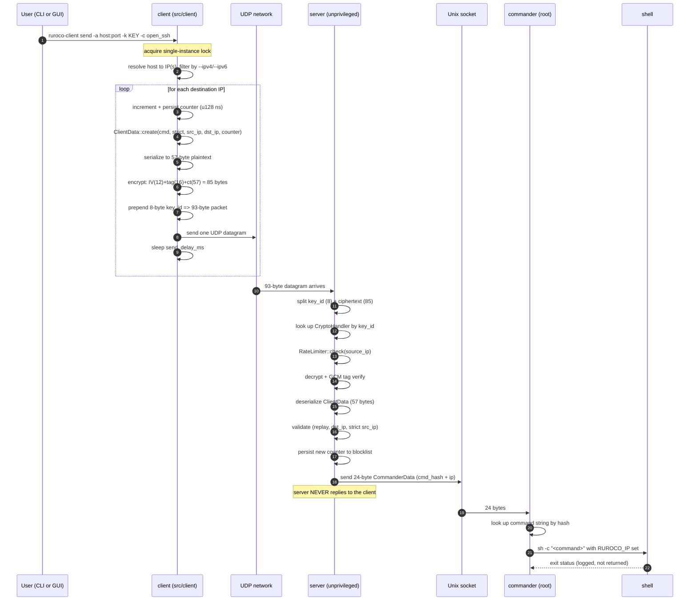

# End-to-End Flow

This chapter follows one command from the moment you press Enter on the client to the moment
the shell command runs on the server. It is the single most important page for understanding how
the modules fit together. Each step links to the leaf chapter that documents it in detail.

## The whole journey at a glance

## Phase 1: the client builds and sends the packet

Driven by `Sender::send` ([send/](../client/send.md)).

1. **Lock.** The client acquires a PID-based single-instance lock at `<conf_dir>/client.lock`
   so two runs cannot race the counter ([lock.rs](../client/counter-lock-gen-util.md)).
2. **Resolve.** The destination `--address` is resolved to one or more IPs, filtered by the
   `--ipv4` / `--ipv6` flags. The client then loops over each destination IP.
3. **Counter.** For each IP it increments the persistent counter and writes it to disk
   immediately. The counter is a `u128` nanosecond value, seeded to "now" on first use, and is
   strictly increasing ([counter.rs](../client/counter-lock-gen-util.md)). This is what makes
   replays impossible.
4. **Build plaintext.** `ClientData::create` hashes the command name with Blake2b-64 and packs
   `cmd_hash`, `counter`, `strict`, `src_ip`, `dst_ip` into a fixed **57-byte** layout
   ([Wire Protocol](./protocol.md)). Note the inversion: the CLI flag is `--permissive`, but the
   packet carries `strict = !permissive`.
5. **Encrypt.** The 57 bytes are encrypted with AES-256-GCM-SIV using the shared key. A fresh random
   IV is generated per packet. Output is `IV(12) || tag(16) || ciphertext(57)` = **85 bytes**
   ([Cryptography](./cryptography.md)).
6. **Frame.** The 8-byte `key_id` is prepended, giving the final **93-byte** packet. The key_id
   tells the server which shared key to use without revealing it.
7. **Send.** Exactly one UDP datagram goes out per destination IP, with `send_delay_ms` between
   IPs. The client does not wait for and does not expect a reply.

## Phase 2: the server receives and validates

Driven by the server main loop and `handler.rs` ([Server Overview](../server/overview.md),
[handler.rs](../server/handler.md)).

1. **Receive.** `socket.rs` reads a datagram into a 93-byte buffer. The socket is either
   inherited from systemd socket activation or bound to `[::]` as a fallback
   ([socket.rs](../server/socket-signal.md)).
2. **Decode frame.** The first 8 bytes are the `key_id`; the remaining 85 are the ciphertext
   blob.
3. **Select key.** The server loads every `*.key` file in its config dir at startup; the `key_id`
   selects the matching `CryptoHandler` ([keys.rs](../server/config-keys.md)).
4. **Rate limit.** `RateLimiter::check` enforces a per-IP cap (default 2 requests/second). This is
   throttling, not security ([rate_limiter.rs](../server/blocklist-ratelimiter.md)).
5. **Decrypt.** AES-256-GCM-SIV decrypts and verifies the tag. A bad key or tampered packet fails the
   tag check and is dropped silently.
6. **Deserialize.** The 57-byte plaintext becomes a `ClientData` struct.
7. **Validate**, in order ([handler.rs](../server/handler.md)):
   - **Replay:** the counter must be strictly greater than the highest counter previously seen
     for this `key_id` (the blocklist floor). Equal counts as a replay
     ([blocklist.rs](../server/blocklist-ratelimiter.md)).
   - **Destination IP:** the `dst_ip` in the packet must be one of the server's configured IPs.
   - **Strict source IP:** if the client set `strict` and included a `src_ip`, it must match the
     real source IP of the datagram.
8. **Persist.** On success the new counter becomes the blocklist floor and is written to disk, so
   the same packet can never be accepted again, even across restarts.
9. **Forward.** The server sends a 24-byte `CommanderData` (`cmd_hash[0:8]` + `ip[8:24]`) over the
   Unix socket. It then goes back to listening. It never replies to the client.

## Phase 3: the commander executes

Driven by `commander.rs` and `commander_exec.rs` ([commander](../server/commander.md)).

1. **Receive.** The commander reads the 24-byte `CommanderData` from the Unix socket.
2. **Look up.** It hashes each configured command name with Blake2b-64 and finds the one matching
   `cmd_hash`. An unknown hash is logged and ignored.
3. **Execute.** It runs the configured shell string via `sh -c`, with the environment variable
   `RUROCO_IP` set to the requesting client's IP (so commands can reference `$RUROCO_IP`, for
   example to allow that exact IP through the firewall).
4. **Done.** The exit status is logged. Nothing is sent back to the server or the client.

## Why this shape

- **Two processes, one socket.** Splitting `server` (unprivileged, network-facing) from
  `commander` (privileged, local-only) means a bug in the parser cannot directly run privileged
  commands; it can only ever push 24 well-formed bytes through a Unix socket whose other end is
  the commander.
- **Counter written before send, floor written after accept.** The client advances its counter
  before sending and the server advances its floor only after accepting. Combined with the
  strictly-greater check, this guarantees monotonic, gap-tolerant replay protection even if
  packets are lost or reordered.
- **No response, ever.** The absence of a reply is a feature. There is no oracle to probe and no
  packet for an attacker to elicit.

Continue with the [Wire Protocol](./protocol.md) to see the exact bytes, or jump straight into a
subsystem via [Client Overview](../client/overview.md) or [Server Overview](../server/overview.md).
