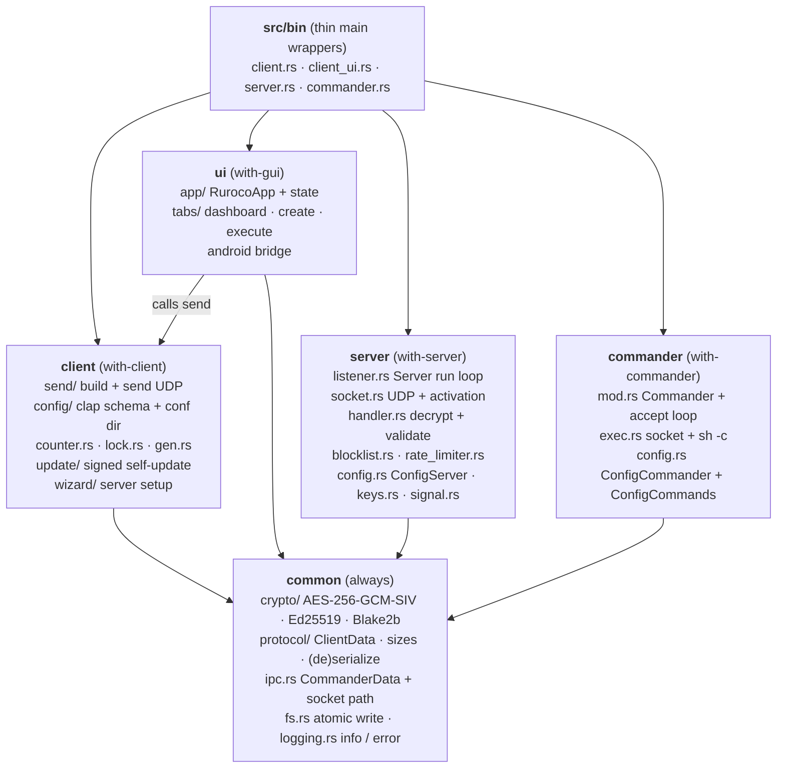

# Top-Level Modules

The crate is a single Rust library (`src/lib.rs`) plus four thin binary entry points
(`src/bin/`). Which modules compile is decided by Cargo features, so the same source tree
produces four very different binaries.

## The library root

`src/lib.rs` simply exposes the four top-level modules, each behind a feature gate:

```rust
#[cfg(feature = "with-client")]
pub mod client;     // CLI client
#[cfg(feature = "with-commander")]
pub mod commander;  // privileged root executor
pub mod common;     // always compiled: shared crypto/protocol/ipc/fs/logging
#[cfg(feature = "with-server")]
pub mod server;     // network-facing daemon
#[cfg(feature = "with-gui")]
pub mod ui;         // egui GUI
```

`common` is always built. `client`, `commander`, `server`, and `ui` are opt-in. `with-gui` implies
`with-client` (the GUI needs the client's send path), `android-build` implies `with-gui`, and
`with-server` implies `with-commander` (the server produces the IPC type the commander consumes, and
its integration tests drive a real commander). The commander on its own (`with-commander`) links
neither OpenSSL nor the UDP/decrypt path.

## The binaries

Each binary in `src/bin/` is a minimal `main()` that parses CLI args and dispatches into the
library. The real logic lives in the modules so it stays unit-testable.

| Binary | Entry point | Feature | One-liner |
| --- | --- | --- | --- |
| `client.rs` | `client::run_client(CliClient::parse())` | `with-client` | CLI dispatch |
| `client_ui.rs` | `ui::run_ui()` | `with-gui` | desktop GUI window |
| `server.rs` | `server::run_server(CliServer::parse())` | `with-server` | UDP daemon |
| `commander.rs` | `commander::run_commander(CliCommander::parse())` | `with-commander` | privileged executor |

On Android the GUI uses `ui::android::android_main` instead of `run_ui` (see
[Android integration](../ui/android.md)).

## Module responsibilities and boundaries



### client
Owns everything that happens on your machine: argument parsing (`config/`), building and
sending the packet (`send/`), the persistent replay counter (`counter.rs`), a PID-based
single-instance lock (`lock.rs`), shared-key generation (`gen.rs`), signed self-update
(`update/`), and the interactive server-setup wizard (`wizard/`). Hard invariant: the client
only ever sends Blake2b-64 *hashes* of command names, never command strings.

### ui
A view layer over `client`. It does not open its own sockets. When the user runs a saved
command, the execute tab calls the client's send path synchronously. The GUI adds persistence
of saved commands (`commands_list.toml`) and, on Android, a JNI bridge for clipboard, soft
keyboard, status-bar inset, and key storage in SharedPreferences.

### server
The only internet-facing component, and deliberately unprivileged. It binds the UDP socket
(or inherits it from systemd socket activation), decrypts each datagram, enforces a per-IP
rate limit, deserializes the plaintext, and validates it (replay floor, destination IP, strict
source-IP match). On success it forwards a 24-byte `CommanderData` message over a Unix socket.
It never writes anything back to the network.

### commander
The privileged half of the server side: its own top-level `src/commander` module, built as a
separate binary and run as a separate (root) process under the `with-commander` feature. It owns the
Unix socket, maps the command hash to a configured shell string, and runs it with `$RUROCO_IP` set
to the requesting client's IP. It deliberately links neither OpenSSL nor any of the network/decrypt
code; `with-server` is a superset of `with-commander`.

### common
Code shared by the above. The two most load-bearing submodules are `crypto/` (AES-256-GCM-SIV
encrypt/decrypt, Ed25519 verification for updates, Blake2b-64 hashing) and `protocol/` (the
`ClientData` plaintext struct, the fixed byte sizes, and (de)serialization). `ipc.rs` holds the one
runtime contract shared by the server and commander (`CommanderData` + the Unix socket path); the
config structs themselves are not here (`ConfigServer` is server-only, `ConfigCommander`/
`ConfigCommands` commander-only). `fs.rs` provides atomic, fsync-backed writes used for the counter,
blocklist, and saved-command list. `logging.rs` is a tiny custom logger
(`info` / `error`) with no external log crate.

## Feature-gate matrix

Because modules are feature-gated, individual functions and even `impl` blocks are too. A useful
mental model:

| Capability | Gated by | Notes |
| --- | --- | --- |
| `encrypt` | `with-client` | only the client encrypts |
| `decrypt` | `with-server` | only the server decrypts |
| `ClientData::create` / `serialize` | `with-client` | client builds the plaintext |
| `ClientData::deserialize` / validation | `with-server` | server reads it |
| `verify_ed25519` | `with-client` | self-update signature check |
| OpenSSL (`crypto::handler`, `get_random_range`) | `with-client` or `with-server` | the commander links none of it |
| `ipc` (`CommanderData`, socket path), `normalize_ip` | `with-server` or `with-commander` | the runtime contract shared by both roles |
| `write_atomic` | `with-server` or `with-gui` | the components that persist files |

This is why `cargo check --no-default-features` is part of `make check`: it proves the shared
code still compiles when only `common` is present. The build minimization (the commander dropping
OpenSSL) is verified per-feature with `ldd` / `cargo tree`.
