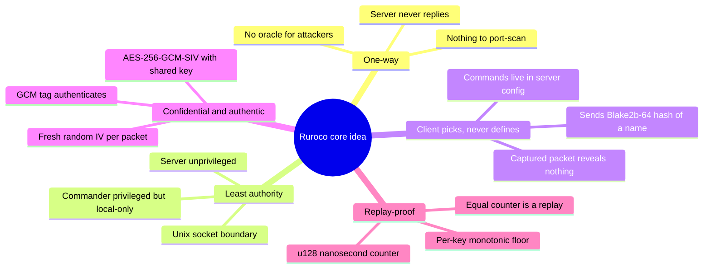
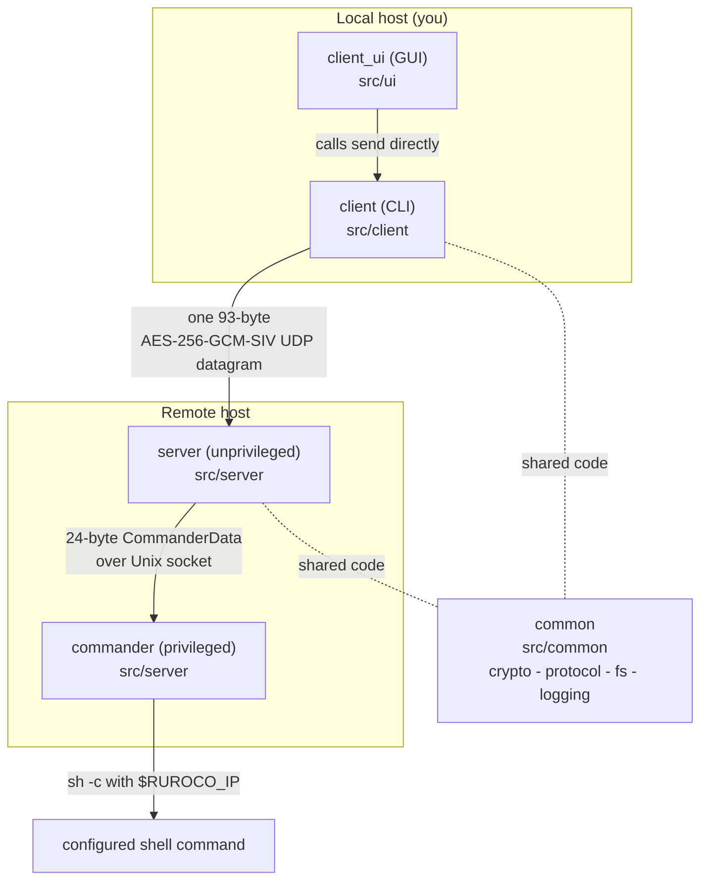

# Overview and Core Idea

Ruroco is built around one deliberately narrow idea: **a client proves, with a shared secret,
that it is allowed to trigger a named command on a server, while revealing nothing to anyone
watching the wire and giving an attacker nothing to attack.**

Everything in the codebase follows from that sentence. This chapter explains the idea and the
shape of the system before the later chapters drill into the flow, the protocol, and the
individual files.

## The problem being solved

Exposing a service port to the internet (SSH, a web admin panel, a database) invites constant
brute-force traffic and leaves you one zero-day away from compromise. The safe move is to keep
the port firewalled shut. But then *you* cannot reach it either.

Ruroco resolves this tension. The port stays shut. When you want in, you send one encrypted UDP
packet that authorizes a server-defined command (for example "add a firewall allow-rule for my
IP"). The port opens just for you, just long enough to connect. A second command closes it again.

Opening a port like this is the use case that overlaps with a VPN — but it is only one shape of what
ruroco does. The general job is to **trigger a server-defined action**: deploy, restart a service,
rotate a secret, run a backup. In those cases there is no service to connect to, only something to
make happen — and a VPN does not apply.

## Ruroco is not a VPN

A fair question is why not just hide everything behind a VPN like
[WireGuard](https://www.wireguard.com/) and open the tunnel when you need a service. For *reaching
your own services yourself*, a VPN is the better tool: WireGuard is also silent to unauthenticated
packets, far more heavily audited than any custom daemon, and gives you all your services at once
once connected. Ruroco does not try to replace it.

The distinction is what each one grants. **A VPN grants access; ruroco grants a capability.** A VPN
peer gets a position on your network and bidirectional reach to everything behind the tunnel, and a
compromised client inherits that foothold. A ruroco client can only fire whitelisted, pre-defined
commands and never gets a network position at all. That makes ruroco the right tool where a VPN does
not fit:

- **triggering server-side actions** (deploy, restart, backup) where there is no service to connect
  to, only an action to perform;
- **triggers from clients that cannot or should not hold a tunnel** — a CI runner, a cron job, an IoT
  device, a phone tap: one stateless UDP packet, no handshake, no session;
- **granting a third party an action without granting them your network** — capability without
  connectivity, a least-privilege property a VPN cannot express.

Putting ruroco *in front of* a VPN (knock to open the WireGuard port) is **not** a security win: it
fronts a more-audited daemon with a less-audited one without removing the internet-facing packet
parser. Use ruroco for what only it does — triggering actions — not to wrap a VPN that is already
silent on its own.

## The design constraints

These constraints are invariants. They are enforced throughout the code and called out in the
per-module chapters.

## The four modules at a glance

- **`client`** (`src/client`) is the CLI. It hashes a command name, builds the plaintext,
  encrypts it, and sends exactly one UDP datagram per destination IP. It also owns the local
  replay counter, key generation, self-update, and the server-setup wizard.
- **`ui`** (`src/ui`) is an egui GUI. It is a thin view layer: it calls the client's send path
  directly rather than reimplementing networking. The same binary runs on desktop and Android.
- **`server`** (`src/server`) is the unprivileged, internet-facing daemon. It receives the
  datagram, decrypts it, runs rate-limit / replay / IP checks, and forwards an authorized
  command to the commander. It never sends a network response.
- **`commander`** (`src/server`, separate binary) is the privileged executor. It owns a local
  Unix socket, looks the command hash up in its config, and runs the configured shell command.
- **`common`** (`src/common`) is the shared library: cryptography, the wire protocol, atomic
  file IO, and the project's own logger. Both client and server compile pieces of it, gated by
  Cargo features.

## Where to go next

- [Top-Level Modules](./modules.md): the responsibilities and boundaries of each module, and a
  dependency map.
- [End-to-End Flow](./end-to-end-flow.md): a single packet's journey from keypress to executed
  command, with sequence diagrams.
- [Wire Protocol](./protocol.md) and [Cryptography](./cryptography.md): the exact bytes and how
  they are protected.
- [Security Model](./security.md): the threats ruroco defends against and how.
