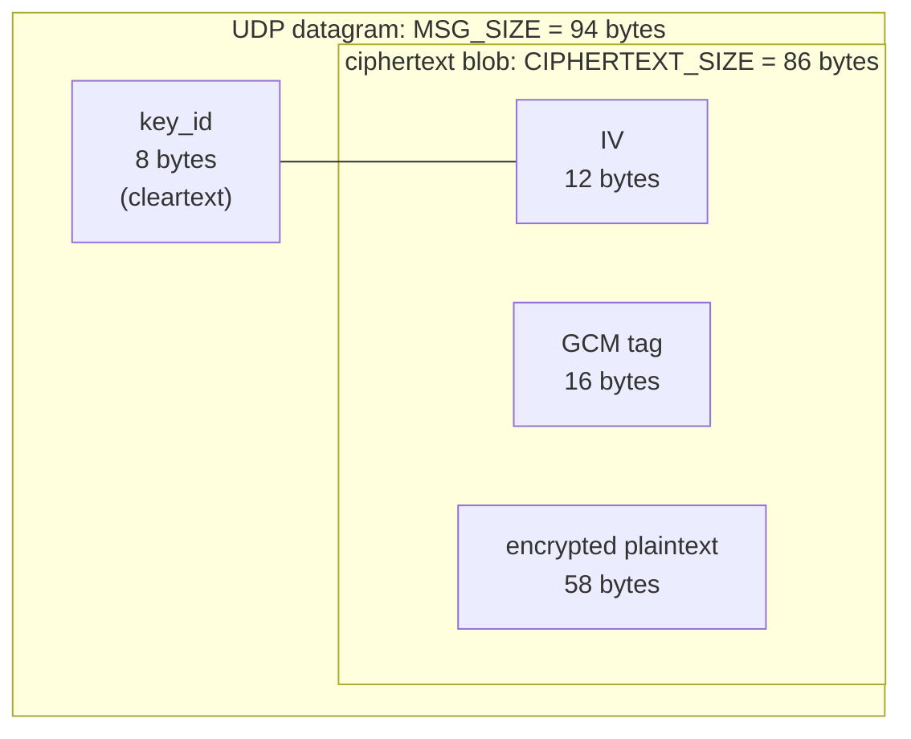
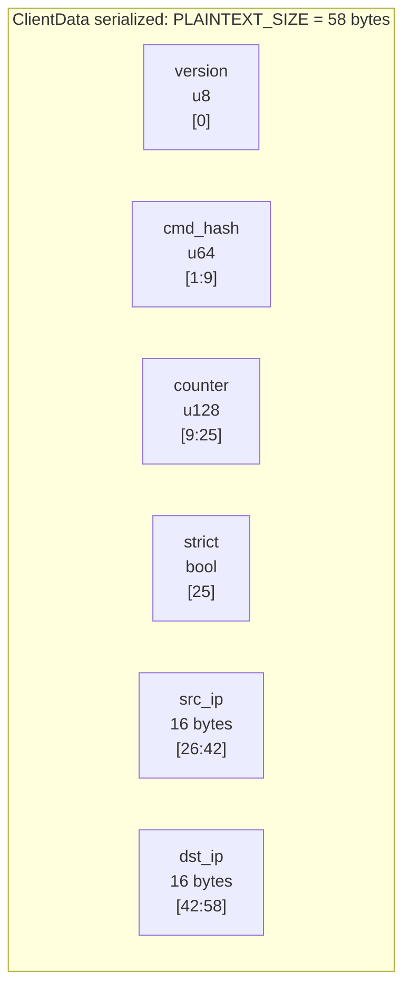

# Wire Protocol

The protocol is intentionally tiny and **fixed-size**. Every packet on the wire is exactly
94 bytes. There is no length prefix and no negotiation. A single version byte rides inside the
authenticated plaintext (it is not visible on the wire), and otherwise there is no structure for an
observer to exploit. This keeps the parser trivial.

> The sizes are defined in `src/common/protocol/constants.rs` and must not be changed without
> understanding the full impact. The file-level documentation lives in
> [common/protocol](../common/protocol.md).

## The constants

```rust
pub(crate) const PLAINTEXT_SIZE: usize  = 58;
pub(crate) const CIPHERTEXT_SIZE: usize = 86;
pub(crate) const KEY_ID_SIZE: usize     = 8;
pub(crate) const MSG_SIZE: usize        = KEY_ID_SIZE + CIPHERTEXT_SIZE; // = 94
```

## The 94-byte packet on the wire



- **`key_id` (8 bytes, cleartext).** Identifies which shared key encrypted this packet. It is
  not secret: it only lets the server pick the right key out of the several it may have loaded.
  It is generated randomly alongside the key by `gen`.
- **ciphertext blob (86 bytes).** The output of AES-256-GCM-SIV, laid out as `IV(12) || tag(16) ||
  ciphertext(58)`. See [Cryptography](./cryptography.md).

The framing is done in `src/common/protocol/parser.rs`:

- **encode** (client): `encrypt(plaintext)` then prepend `key_id`.
- **decode** (server): split `[0..8]` as `key_id` and `[8..94]` as the ciphertext blob.

## The 58-byte plaintext: `ClientData`

Before encryption, the client packs a version byte plus five fields into a fixed 58-byte buffer,
**big-endian**. This is the `ClientData` struct (`src/common/protocol/client_data.rs`).



| Field | Bytes | Type | Meaning |
| --- | --- | --- | --- |
| `version` | `[0]` | `u8` | `PROTOCOL_VERSION` (currently `1`). Authenticated; checked after the GCM tag verifies. |
| `cmd_hash` | `[1:9]` | `u64` | Blake2b-64 hash of the command *name*. The name itself is never sent. |
| `counter` | `[9:25]` | `u128` | Monotonic nanosecond timestamp. Drives replay protection. |
| `strict` | `[25]` | `bool` | `1` means enforce source-IP match. It is `!permissive` from the CLI. |
| `src_ip` | `[26:42]` | 16 bytes | The claimed client IP, or all-zeros for "none". |
| `dst_ip` | `[42:58]` | 16 bytes | The server IP this packet is for. Must match server config. |

### IPs are always 16 bytes

Both IP fields are always 16 bytes. IPv4 addresses are stored as IPv6-mapped addresses
(`serialize_ip` in `serialization.rs`). On the server they are collapsed back to IPv4 where
applicable by `normalize_ip`. A `src_ip` of all-zeros deserializes to `None`, which is how the
client says "I did not claim a source IP".

### The strict / permissive logic

`is_source_ip_invalid` on the server rejects a packet only when **both** of these hold:

- the client set `strict` (that is, the user did **not** pass `--permissive`), and
- the client included a non-empty `src_ip` that differs from the datagram's real source IP.

So:

- Default (`strict = true`, no `--ip`): no `src_ip` is claimed, so the strict check passes
  trivially; the firewall command sees the real source IP via `$RUROCO_IP`.
- `--ip X` without `--permissive`: the server enforces that the real source IP equals `X`. This
  defends against an attacker spoofing your source address.
- `--ip X --permissive`: the server accepts the packet from any source and uses `X` downstream.
  Useful when the packet egresses from a different IP than the one you want authorized.

## Serialization and round-trip

- `ClientData::create(command, strict, src_ip, dst_ip, counter)` hashes the name and fills the
  struct (client side).
- `ClientData::serialize(&self) -> [u8; 58]` writes the big-endian layout (client side).
- `ClientData::deserialize([u8; 58]) -> ClientData` reads it back (server side).

The struct's tests assert that the serialized form is always exactly 58 bytes regardless of field
values (a `u128::MAX` counter and a full IPv6 address still fit) and that a `create -> serialize ->
deserialize` round-trip reproduces the original.

## Why fixed-size matters

- **No parser ambiguity.** The server knows a valid packet is exactly 94 bytes; anything else is
  discarded before any crypto runs.
- **No information leak via length.** Every authorized command, short or long, produces the same
  94 bytes. An observer cannot distinguish "open_port" from "deploy_production" by size.
- **Constant work per packet.** The server does the same bounded work for every datagram, which
  bounds the cost of flood traffic (further capped by the rate limiter).

Continue to [Cryptography](./cryptography.md) for how the 58 bytes become the 86-byte ciphertext
blob, or [common/protocol](../common/protocol.md) for the file-by-file implementation.
