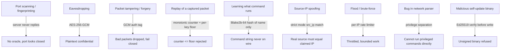
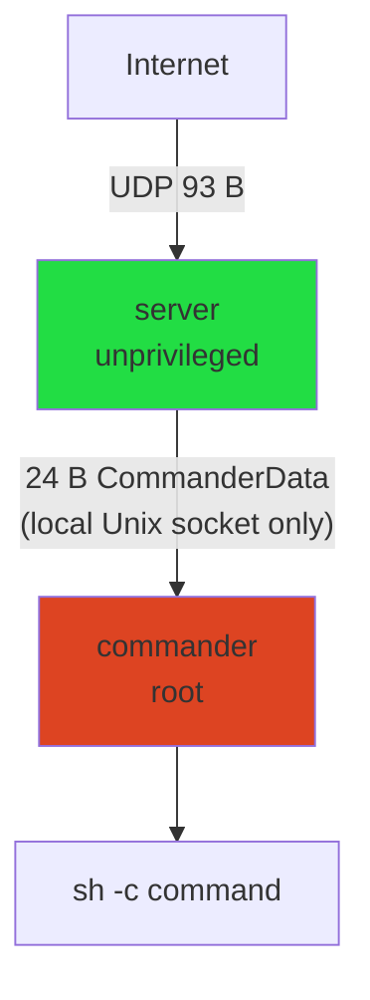

# Security Model

This chapter states the threats ruroco is designed to resist, the mechanisms that resist them, and
the assumptions that must hold. It ties together the protocol, the cryptography, and the two-process
server design.

## Threat model

Ruroco assumes a powerful network attacker who can:

- observe all traffic to and from the server (passive eavesdropping),
- send arbitrary UDP packets to the server (active injection),
- capture and replay packets you sent earlier,
- port-scan and fingerprint the host,
- spoof source IP addresses.

Ruroco assumes the attacker **cannot**:

- read the shared AES key (it is provisioned out of band and never transmitted),
- execute code on the server host already (that is game over regardless),
- break AES-256-GCM or Ed25519.

## Defenses, mapped to mechanisms

### 1. Silence defeats reconnaissance
The server sends **no response of any kind**, ever. A scanner cannot tell an open ruroco port from
a closed one, there is no banner to fingerprint, and there is no reply packet to use as an oracle.
This is an architectural invariant, not a config option.

### 2. Confidentiality and authenticity: AES-256-GCM
The packet body is encrypted and authenticated with AES-256-GCM under the shared key. Eavesdroppers
see only random-looking bytes. Tampered or forged packets fail the GCM tag check and are dropped
silently. See [Cryptography](./cryptography.md).

### 3. Replay protection: the monotonic counter
Each packet carries a `u128` counter that the client makes strictly increasing (a nanosecond
timestamp, persisted across runs). The server stores, per `key_id`, the highest counter it has
accepted (the "floor", in the blocklist). A packet is rejected unless its counter is strictly
greater than the floor, so:

- replaying a captured packet fails (its counter equals the floor: equal is a replay),
- the floor is persisted (msgpack) and re-seeded to "now" on startup, so packets older than process
  start are rejected even after a restart.

See [blocklist.rs](../server/blocklist-ratelimiter.md) and [counter.rs](../client/counter-lock-gen-util.md).

> Operational note: each client must use its **own** key. Two clients sharing a key keep independent
> local counters, but the server tracks only one floor per key, so whichever sends last advances the
> floor and the other client's packets start getting rejected as replays. The fix is one key per
> client; `ruroco-client reseed` recovers a single client whose counter fell behind.

### 4. The client cannot choose arbitrary commands
The client sends only a Blake2b-64 hash of a command **name**. The actual shell command lives only
in the server's config. So even a fully compromised client (or a captured packet) can at most
trigger one of the operator-defined commands; it cannot inject a new one.

### 5. Source-IP binding (strict mode)
When you pass `--ip` without `--permissive`, the server enforces that the datagram's real source IP
matches the claimed `src_ip`. This stops an attacker from replaying or spoofing a packet to
authorize their own address. With `--permissive` the check is relaxed deliberately, for the case
where your packet egresses from a different IP than the one you want allowed.

### 6. Rate limiting (throttling, not security)
`RateLimiter` caps requests per source IP (default 2/second, in-memory). This blunts floods and
brute-force noise. It is explicitly **not** a replay or auth defense (it resets on restart and is
per-IP); the counter and GCM tag are the real defenses.

### 7. Privilege separation: two processes, one socket
The internet-facing `server` runs **unprivileged**. It can receive, decrypt, validate, and write at
most a 24-byte `CommanderData` to a Unix socket. The privileged `commander` runs as root, owns the
other end of that socket, and is the only component that executes commands. A vulnerability in the
network-facing parser therefore cannot directly run privileged commands; the blast radius is bounded
by the Unix-socket interface.

The systemd units reinforce this: the server runs as a dedicated low-privilege `ruroco` user, the
binaries are installed mode `0o500` and owned appropriately, and the wizard sets it all up
([wizard](../client/wizard.md)).

### 8. Signed self-update
Self-update verifies an Ed25519 signature against an embedded public key before writing any binary
to disk. A compromised download path cannot deliver code that runs. See
[Cryptography](./cryptography.md) and [client/update](../client/update.md).

## Residual risks and assumptions

- **Key secrecy is everything.** Anyone with the shared key can craft valid packets (subject to the
  counter). Store it in a password manager or keyring; the README suggests `secret-tool`.
- **Command safety is the operator's job.** The commander runs whatever the config says via
  `sh -c`, with `$RUROCO_IP` interpolated. Keep commands minimal and treat `$RUROCO_IP` as
  attacker-influenced input when writing them.
- **The rate limiter is in-memory.** A restart clears it; it is a throttle, not a guarantee.
- **Clock sanity.** The counter is a timestamp. A large backward clock jump on the client can make
  its counter lag the server's floor; `reseed` fixes this.

## No-panic discipline as a security property

Production code uses `anyhow::Result` everywhere and forbids `unwrap`, `expect`, `panic!`, and
fallible indexing. A network-facing daemon that cannot be crashed by a malformed packet is part of
the security posture, not just code hygiene. All error paths log and continue (or drop the packet);
they never abort the process.
