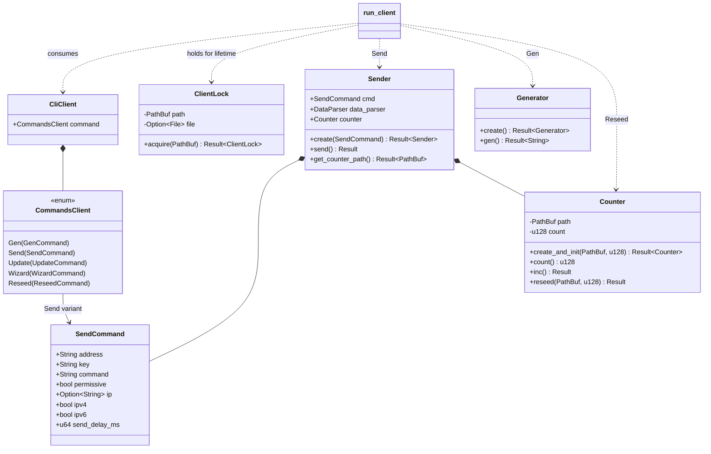
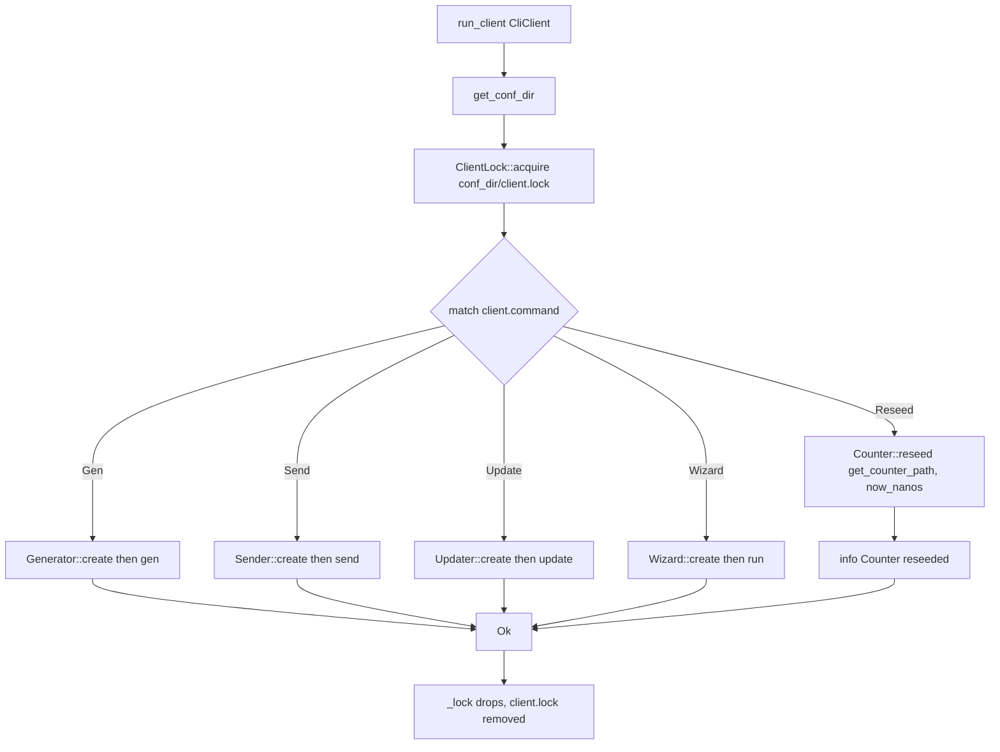

# Client Architecture Overview

The ruroco client is a CLI program that builds and sends a single encrypted UDP
datagram to a ruroco server. It never opens a return channel and never learns
the actual shell command that the server will run: it only transmits a Blake2b-64
hash of a command *name*. This document describes the client entry point, the
subcommand dispatch model, the configuration-directory model, and the invariants
that hold across the whole client.

## Entry points: `run_client` and `run_client_send`

Both entry points live in `src/client/mod.rs` and take an already-parsed
`CliClient` value (clap parses `argv` into `CliClient` in the binary's `main`).

```rust
pub fn run_client(client: CliClient) -> anyhow::Result<()>
pub fn run_client_send(client: CliClient) -> anyhow::Result<()>
```

### `run_client`

`run_client` is the full dispatcher used by the standard client binary. Its steps:

1. Resolve the configuration directory with `config::get_conf_dir()?`.
2. Acquire a single-instance PID lock at `<conf_dir>/client.lock` via
   `ClientLock::acquire(...)`. The lock is held in a `_lock` binding for the
   whole function body; its `Drop` impl removes the lock file on return.
3. Match on `client.command` (a `CommandsClient`) and dispatch:
   - `Gen(_)` builds `Generator::create()?` and calls `.gen()?`.
   - `Send(send_command)` builds `Sender::create(send_command)?` and calls `.send()`.
   - `Update(update_command)` builds an `Updater` from the command's
     `force`, `version`, `bin_path`, and `server` fields and calls `.update()`.
   - `Wizard(_)` runs `Wizard::create().run()`.
   - `Reseed(_)` calls `Counter::reseed(Sender::get_counter_path()?, now_nanos()?)?`,
     logs `Counter reseeded`, and returns `Ok(())`.

### `run_client_send`

`run_client_send` is a narrowed entry point that only accepts the `Send`
subcommand. It does **not** acquire the lock and does **not** resolve the conf
dir itself. For any non-`Send` command it returns an error with the exact text
`Invalid command for run_client_send`. This path exists for callers (for example
the GUI/Android side) that have already established their own single-instance
guarantees and only ever want to send.

## The `CommandsClient` enum and dispatch table

`CommandsClient` (defined in `src/client/config/mod.rs`) is the clap subcommand
enum carried inside `CliClient`. Each variant wraps a command struct from
`src/client/config/commands.rs`.

| Variant | Wrapped struct | Handler in `run_client` | Effect |
| --- | --- | --- | --- |
| `Gen` | `GenCommand` | `Generator::gen()` | Print a fresh base64 AES key with embedded key id |
| `Send` | `SendCommand` | `Sender::send()` | Build and send the encrypted UDP packet |
| `Update` | `UpdateCommand` | `Updater::update()` | Self-update the client (or server) binary |
| `Wizard` | `WizardCommand` | `Wizard::run()` | Interactive server-side setup |
| `Reseed` | `ReseedCommand` | `Counter::reseed()` | Reset the replay counter to `now_nanos()` |

Only `Send` and `Gen` belong to the core/config/send subsystems documented in
this book section. `Update` and `Wizard` live in sibling modules.

## Configuration-directory model

Every persistent client artifact lives under one configuration directory,
resolved exactly once per invocation by `config::get_conf_dir()`:

- `<conf_dir>/client.lock`: the single-instance PID lock (see `lock.rs`).
- `<conf_dir>/counter`: the replay counter, a raw big-endian `u128`
  (see `counter.rs`, path produced by `Sender::get_counter_path()`).

On Linux, `get_conf_dir()` prefers the `RUROCO_CONF_DIR` environment variable,
then `$HOME/.config/ruroco`, then the current working directory. It creates the
directory if it is missing. Tests set `RUROCO_CONF_DIR` to a `tempfile::tempdir()`
to isolate state. See `config.md` for the full resolution logic.

## Invariants

These hold across the entire client and are enforced by code and by the project
rules:

- **Hashes only, never commands.** `ClientData::create` stores
  `cmd_hash: blake2b_u64(command)`. The plaintext that gets encrypted contains
  the 8-byte hash, not the command string, so the wire never carries a command name.
- **Unidirectional.** The client only ever calls `socket.send`. It never reads a
  response; the server never sends one.
- **Fixed packet geometry.** The encrypted plaintext (`ClientData::serialize`) is
  exactly `PLAINTEXT_SIZE = 57` bytes. The full datagram is `MSG_SIZE = 93` bytes:
  an 8-byte key id followed by an 85-byte ciphertext block
  (`CIPHERTEXT_SIZE = 85` = 12-byte IV + 16-byte GCM tag + 57-byte ciphertext).
- **IPv6-mapped storage.** All IP addresses are serialized as 16 bytes; the unset
  source IP is all-zero (16 zero bytes).
- **Monotonic counter.** The counter is a nanosecond timestamp seeded to
  `now_nanos()` and incremented (overflow-checked) and persisted on every send, so
  the server's replay floor only moves forward.
- **No panics in production.** All fallible paths return `anyhow::Result<T>` and add
  context with `.with_context(...)`; `.unwrap()`/`.expect()` appear only in tests.
- **`pub(crate)` over `pub`.** Internal items are crate-private; only the handful of
  types that the binaries and GUI need (for example `CliClient`, `SendCommand`,
  `Sender`, `Generator`, `Counter`) are `pub`.

## Type relationships



## `run_client` dispatch flow


