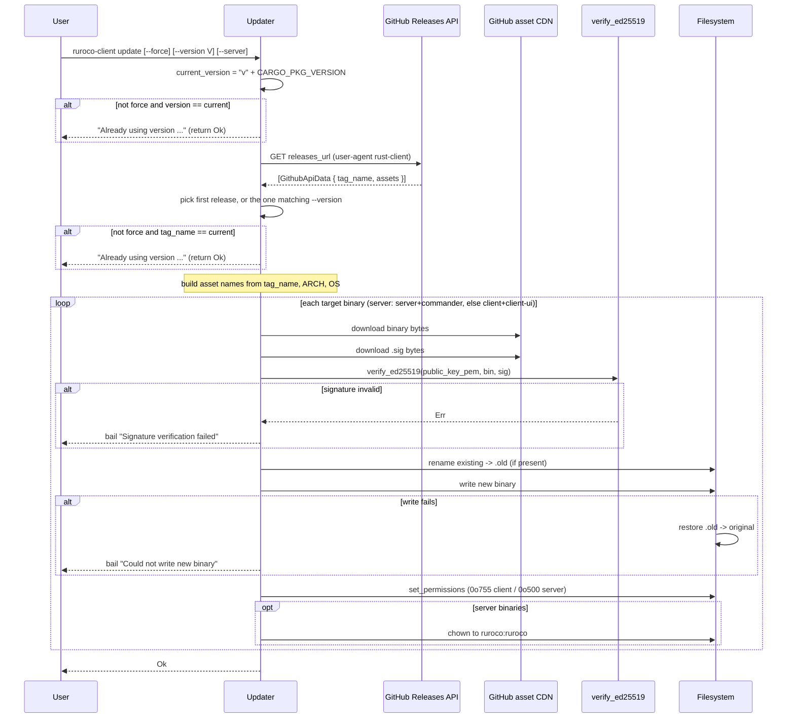
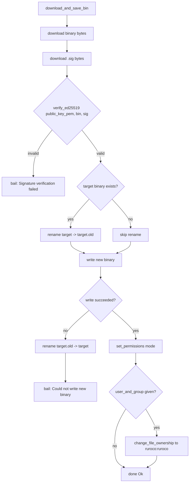
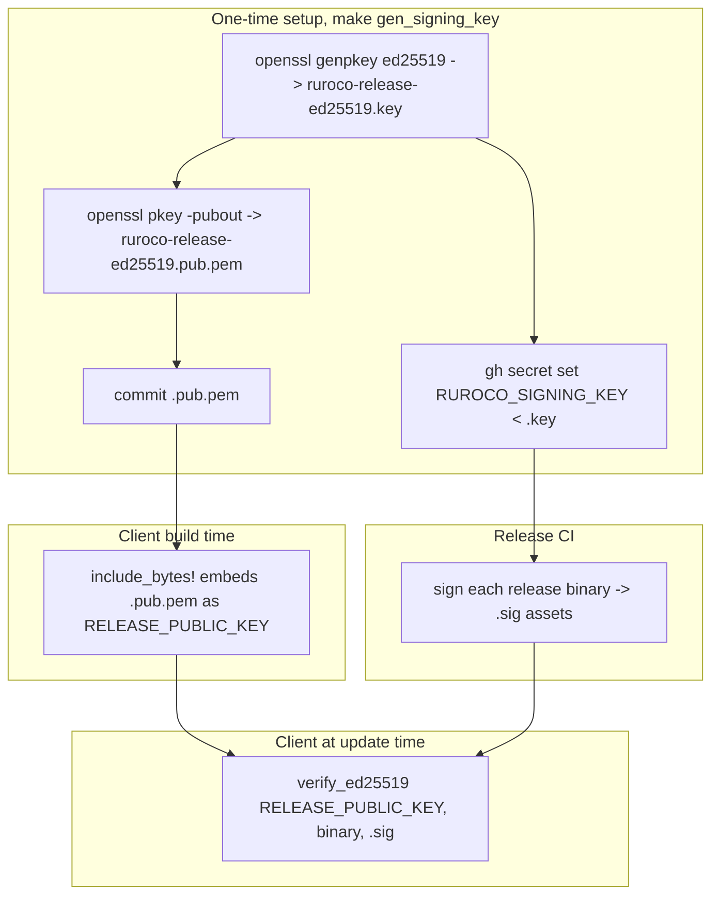

# Client Self-Update

The client self-update subsystem lets `ruroco-client` (and, with `--server`, the server-side
binaries) replace themselves in place from signed GitHub releases. It lives in
`src/client/update/` and is split into three files:

- `mod.rs`: the `Updater` type, version comparison, and the per-arch/OS download orchestration.
- `github.rs`: GitHub releases API lookup, the embedded release public key, and binary-name
  constants.
- `filesystem.rs`: download bytes, verify the Ed25519 signature, swap the on-disk binary safely,
  and set permissions/ownership.

The defining security property: **every downloaded binary is verified against an Ed25519
signature before it is written to disk**. The public key is embedded into the client at build
time so a tampered download cannot strip or swap it. If the `.sig` asset is missing or the
signature does not match, the update aborts and the existing binary is left untouched. As a
result, the client can only update to releases that ship signatures (`v0.14.0` and later).

## Update flow overview



## `mod.rs`

### `struct Updater`

```rust
#[derive(Debug)]
pub(crate) struct Updater {
    pub(super) force: bool,
    pub(super) version: Option<String>,
    pub(super) bin_path: PathBuf,
    pub(super) server: bool,
    /// Ed25519 public key (PEM) used to verify downloaded binaries. Defaults to the
    /// embedded release key; overridable in tests for hermetic signing.
    pub(super) public_key_pem: Vec<u8>,
    /// GitHub releases API URL. Defaults to the real endpoint; overridable in tests.
    pub(super) releases_url: String,
}
```

Field responsibilities:

- `force`: when `true`, skips both "already up to date" short-circuits and always downloads.
- `version`: an optional explicit release tag (for example `v0.14.2`). `None` means "latest".
- `bin_path`: the directory the binary or binaries are written into.
- `server`: when `true`, downloads and installs the server-side binaries (`ruroco-server` and
  `ruroco-commander`) instead of the client binaries (`ruroco-client` and `ruroco-client-ui`).
- `public_key_pem`: the Ed25519 public key in PEM form used for verification. In production it is
  initialized from the embedded `RELEASE_PUBLIC_KEY`. It is a struct field (not a hard-coded
  constant inside the verify path) precisely so tests can inject a freshly generated keypair.
- `releases_url`: the releases endpoint. Defaults to `GH_RELEASES_URL`. Overridable so tests can
  point at a local `TcpListener` instead of hitting GitHub.

### `Updater::create`

```rust
pub(crate) fn create(
    force: bool,
    version: Option<String>,
    bin_path: Option<PathBuf>,
    server: bool,
) -> anyhow::Result<Self>
```

Resolves the target directory and builds an `Updater` with the production defaults
(`public_key_pem: RELEASE_PUBLIC_KEY.to_vec()`, `releases_url: GH_RELEASES_URL.to_string()`).

`bin_path` resolution:

- `Some(p)` that does not exist or is not a directory: `bail!("{p:?} does not exist or is not a
  directory")`.
- `Some(p)` valid directory: validated via `validate_dir_path`.
- `None` and `server == true`: defaults to `SERVER_BIN_DIR` (`/usr/local/bin`), validated.
- `None` and `server == false`: defaults to `$HOME/.local/bin`, validated. Requires the `HOME`
  env var (`Could not get home env` on failure).

`validate_dir_path` (in `filesystem.rs`) creates the directory if missing, errors if the path
exists but is not a directory, and errors if it is not writable.

### `Updater::update`

```rust
pub(crate) fn update(&self) -> anyhow::Result<()>
```

The orchestration entry point. Steps:

1. Compute `current_version = format!("v{}", env!("CARGO_PKG_VERSION"))`. The leading `v` matters:
   GitHub tags are `vX.Y.Z`, so the comparison is tag-to-tag.
2. Early skip: if `!force` and `Some(current_version) == self.version`, log "Already using version
   ..." and return `Ok(())` without any network call.
3. Fetch release metadata via `get_github_api_data_from(&self.releases_url, self.version.as_ref())`.
4. Second skip: if `!force` and `current_version == api_data.tag_name`, log and return `Ok(())`.
   This catches the `version == None` (latest) case where the latest already matches what is
   installed.
5. Branch on `self.server`:
   - **server**: download `server-{tag}-{ARCH}-{OS}` into `SERVER_BIN_NAME` (`ruroco-server`)
     with mode `0o500` and owner `ruroco`, then `commander-{tag}-{ARCH}-{OS}` into
     `COMMANDER_BIN_NAME` (`ruroco-commander`) with the same mode/owner.
   - **client**: download `client-{tag}-{ARCH}-{OS}` into `CLIENT_BIN_NAME` (`ruroco-client`)
     with mode `0o755` and no chown, then `client-ui-{tag}-{ARCH}-{OS}` into `CLIENT_UI_BIN_NAME`
     (`ruroco-client-ui`) with mode `0o755` and no chown.

Asset names are built from `api_data.tag_name`, `std::env::consts::ARCH`, and
`std::env::consts::OS`, so the client only ever requests the artifact matching the host it runs
on. The signature asset name is the binary asset name plus `.sig`.

### `Updater::get_download_url`

```rust
fn get_download_url(
    &self,
    assets: &[GithubApiAsset],
    client_bin_name: &String,
) -> anyhow::Result<String>
```

Finds the asset whose `name` equals the requested asset name and returns its
`browser_download_url`. If no asset matches, errors with `Could not find {client_bin_name}`. This
is the point at which a release that does not ship the expected `.sig` asset fails: the `.sig`
lookup returns an error and the whole update aborts before anything is written.

### Gotchas

- The version comparison is purely string equality of `vX.Y.Z` tags, not semantic-version
  ordering. "Newer" effectively means "different from current". `--force` bypasses the checks
  entirely and can therefore reinstall or downgrade.
- The download targets the exact `ARCH`/`OS` of the running binary. Cross-installing for a
  different platform is not supported through this path.

## `github.rs`

### Constants

```rust
pub(super) const GH_RELEASES_URL: &str = "https://api.github.com/repos/beac0n/ruroco/releases";
pub(super) const SERVER_BIN_DIR: &str = "/usr/local/bin";
pub(super) const COMMANDER_BIN_NAME: &str = "ruroco-commander";
pub(super) const SERVER_BIN_NAME: &str = "ruroco-server";
pub(super) const CLIENT_BIN_NAME: &str = "ruroco-client";
pub(super) const CLIENT_UI_BIN_NAME: &str = "ruroco-client-ui";

/// Ed25519 public key used to verify release binaries during self-update.
pub(super) const RELEASE_PUBLIC_KEY: &[u8] =
    include_bytes!("../../../keys/ruroco-release-ed25519.pub.pem");
```

`RELEASE_PUBLIC_KEY` is embedded at compile time from `keys/ruroco-release-ed25519.pub.pem`. The
matching private key is held only as a CI secret (`RUROCO_SIGNING_KEY`) and signs the binaries at
release time. Embedding it in the binary means a downloaded artifact cannot strip or replace the
verification key.

### `struct GithubApiAsset` and `struct GithubApiData`

```rust
#[derive(Serialize, Deserialize, Debug, Clone)]
pub(crate) struct GithubApiAsset {
    pub(crate) name: String,
    pub(crate) browser_download_url: String,
}

#[derive(Serialize, Deserialize, Debug, Clone)]
pub(crate) struct GithubApiData {
    pub(crate) tag_name: String,
    pub(crate) assets: Vec<GithubApiAsset>,
}
```

Minimal deserialization targets for the subset of the GitHub releases JSON that the updater
needs: the tag and the asset list with download URLs. `GithubApiAsset` is re-exported at the
module level (`pub(crate) use github::GithubApiAsset`).

### `Updater::get_github_api_data_from`

```rust
pub(super) fn get_github_api_data_from(
    releases_url: &str,
    version_to_download: Option<&String>,
) -> anyhow::Result<GithubApiData>
```

Builds a `ureq` agent with user-agent `rust-client` (GitHub rejects requests without a user
agent), GETs the releases URL, and parses the JSON array of `GithubApiData`. Selection:

- `version_to_download == None`: takes the first element (GitHub returns releases newest-first).
- `version_to_download == Some(v)`: finds the release whose `tag_name == v`.

Errors with `Could not find version {version_to_download:?}` if no release matches.

### `Updater::get_github_api_data` (Android only)

```rust
#[cfg(target_os = "android")]
pub(crate) fn get_github_api_data(
    version_to_download: Option<&String>,
) -> anyhow::Result<GithubApiData>
```

Used only by the Android update path, which queries the releases API to locate the `.apk` asset
and hands it to the OS installer. APK authenticity is enforced by Android's own package signing,
so the Ed25519 check does not apply on that path.

## `filesystem.rs`

This file holds the verify-and-swap logic. The decision flow:



### `Updater::download_and_save_bin`

```rust
pub(super) fn download_and_save_bin(
    &self,
    bin_url: String,
    sig_url: String,
    bin_name: &str,
    permissions_mode: u32,
    user_and_group: Option<&str>,
) -> anyhow::Result<()>
```

The full per-binary install:

1. `target_bin_path = self.bin_path.join(bin_name)`.
2. Download the binary bytes and the signature bytes (both via `download_bytes`).
3. `verify_ed25519(&self.public_key_pem, &bin_resp_bytes, &sig_bytes)`. On failure:
   `Signature verification failed for {bin_name}`. **Verification happens before any disk write.**
4. If the target already exists, rename it to `{target}.old` (`Could not rename existing binary`
   on failure).
5. `fs::write` the new bytes. On write failure, rename `{target}.old` back to the original path
   (`Could not recover old binary` if even that fails) and then `bail!("Could not write new
   binary to ...")`. This is the rollback path: a failed write does not leave the host without a
   working binary.
6. On Unix: `set_permissions(target, permissions_mode)`, then if `user_and_group` is `Some(ug)`,
   `change_file_ownership(target, ug, ug)`.

### `Updater::download_bytes`

```rust
fn download_bytes(url: &str) -> anyhow::Result<Vec<u8>>
```

GETs `url` with `ureq` and reads the full response body into a `Vec<u8>`
(`Could not get binary` / `Could not get bytes`).

### `Updater::validate_dir_path`

```rust
pub(super) fn validate_dir_path(dir_path: PathBuf) -> anyhow::Result<PathBuf>
```

Pattern-matched validation of the target directory:

- Does not exist: `fs::create_dir_all` it (`Could not create .bin directory`), then return it.
- Exists but is not a directory: error `{p:?} exists but is not a directory`.
- Not writable (per `check_if_writable`): error `can't write to {p:?}`.
- Otherwise: return the path.

### `Updater::check_if_writable`

```rust
pub(super) fn check_if_writable(path: &Path) -> anyhow::Result<bool>
```

Probes writability by attempting `NamedTempFile::new_in(path)` and returning whether it
succeeded. This catches read-only or permission-denied target directories up front.

### Gotchas

- The `.old` file is left in place on success. Repeated updates overwrite it. It is the recovery
  copy used only when the new write fails.
- The rollback only covers the `fs::write` failure case. A failure in `set_permissions` or
  `change_file_ownership` after a successful write leaves the new binary in place with the prior
  step's state.
- Ownership change uses the same string for user and group (`ug, ug`), which is why the server
  units run as `ruroco:ruroco`.

## CI signing model

Releases are signed in CI; the client only trusts that one embedded key.



Key points from the `Makefile` `gen_signing_key` target and the README:

- `make gen_signing_key` runs `openssl genpkey -algorithm ed25519` to produce
  `keys/ruroco-release-ed25519.key` (private, gitignored, kept secret and backed up offline) and
  `openssl pkey ... -pubout` to produce `keys/ruroco-release-ed25519.pub.pem` (public, committed,
  embedded into the client). It refuses to overwrite an existing private key.
- The private key is added as the GitHub Actions secret `RUROCO_SIGNING_KEY`
  (`gh secret set RUROCO_SIGNING_KEY < keys/ruroco-release-ed25519.key`). Release CI uses it to
  produce a `.sig` for every published binary asset.
- The public key is embedded into the client at build time via `include_bytes!`, so verification
  needs no network fetch and no key the attacker can substitute.
- Only `v0.14.0` and later releases ship `.sig` assets, so those are the only versions the
  signature-checked update path can install. Earlier releases would fail the `.sig` lookup and
  abort.
