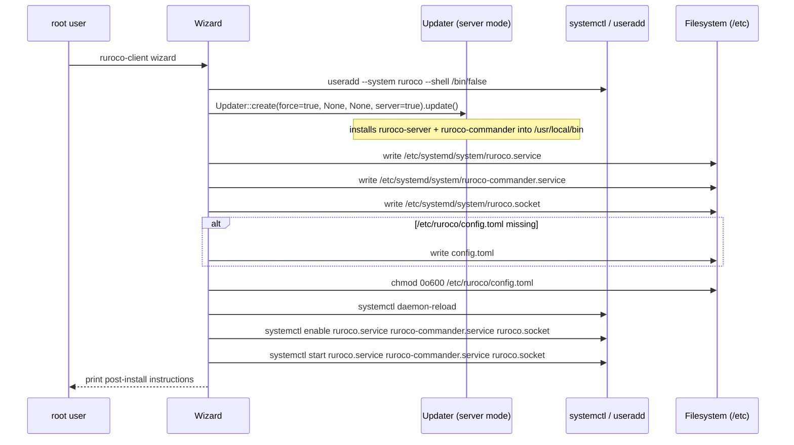
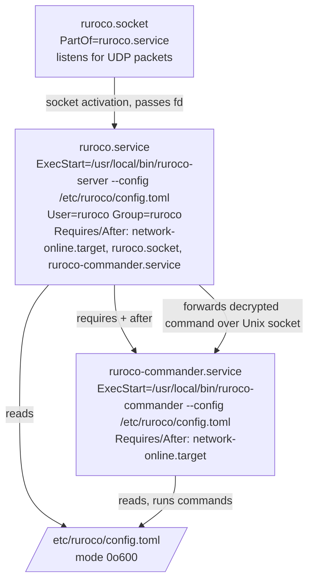

# Server-Side Wizard

The wizard is the one-command server-side installer, invoked as `ruroco-client wizard` and
intended to run as **root**. It installs and starts the server-side ruroco stack on the local
host: it creates the `ruroco` system user, performs a forced self-update of the server binaries,
writes the three systemd units and the server config, and then reloads, enables, and starts the
services.

It lives in `src/client/wizard/` and is split into:

- `mod.rs`: the module declarations and re-export of `Wizard`.
- `core.rs`: the `Wizard` type and the `run` flow plus the file-writing/config helpers.
- `wizard_systemd.rs`: the hard-coded `/etc` paths, the compile-time embedded unit and config
  bytes, and the `systemctl` / `useradd` / `Updater` helpers.

Everything the wizard writes is embedded into the client binary at compile time via
`include_bytes!`, so the installer carries its own copies of the unit files and the config and
needs no extra files on disk.

## Wizard run flow



## `mod.rs`

Declares the submodules and re-exports the public type:

```rust
mod core;
mod wizard_systemd;

pub(crate) use core::Wizard;
```

`Wizard` is the only item exposed to the rest of the crate.

## `core.rs`

### `struct Wizard`

```rust
#[derive(Debug)]
pub(crate) struct Wizard {}

impl Wizard {
    pub(crate) fn create() -> Self { Self {} }
}
```

A unit-like struct: it holds no state. `create()` exists for symmetry with other client
subsystems.

### `Wizard::run`

```rust
pub(crate) fn run(&self) -> anyhow::Result<()>
```

The full installer, executed top to bottom (any step returning `Err` aborts the run via `?`):

1. `create_ruroco_user()`: create the `ruroco` system user (see `wizard_systemd.rs`).
2. `update()`: forced self-update of the server binaries into `/usr/local/bin`.
3. `write_data(RUROCO_SERVICE_FILE_PATH, RUROCO_SERVICE_FILE_DATA)`: write `ruroco.service`.
4. `write_data(COMMANDER_SERVICE_FILE_PATH, COMMANDER_SERVICE_FILE_DATA)`: write
   `ruroco-commander.service`.
5. `write_data(SOCKET_FILE_PATH, SOCKET_FILE_DATA)`: write `ruroco.socket`.
6. `init_config_file()`: write `/etc/ruroco/config.toml` if it does not already exist, then set
   its mode to `0o600`.
7. `reload_systemd_daemon()`: `systemctl daemon-reload`.
8. `enable_systemd_services()`: `systemctl enable` the three units.
9. `start_systemd_services()`: `systemctl start` the three units.
10. Print a multi-line completion banner instructing the operator to review
    `/etc/ruroco/config.toml`, generate a key with `ruroco-client gen`, place the key file in the
    configured `config_dir`, and store the client key in their secure key store.

### `Wizard::init_config_file`

```rust
fn init_config_file() -> anyhow::Result<()>
```

Idempotent config installer. If `CONFIG_TOML_PATH` (`/etc/ruroco/config.toml`) does **not** exist,
it writes the embedded `CONFIG_TOML_FILE_DATA`. Either way, it then calls
`set_permissions(CONFIG_TOML_PATH, 0o600)` (owner read/write only). This means re-running the
wizard never clobbers an operator's edited config, but it always re-asserts the restrictive
permissions.

### `Wizard::write_data`

```rust
fn write_data(path: &str, data: &[u8]) -> anyhow::Result<()>
```

Creates `path` with `fs::File::create` (`Failed to create {path}`) and writes the byte slice
(`Failed to write to {path}`). Used for every unit file and, conditionally, the config. Note that
`File::create` truncates, so the three unit files are overwritten on every run (only the config is
guarded by the existence check). Tests exercise `write_data` against a `tempdir`, including an
invalid-path negative case.

### Gotchas

- `write_data` overwrites unit files unconditionally; only the config is preserved across runs.
- The config existence guard checks the real `/etc/ruroco/config.toml` path; there is no
  injectable path here, so unit tests cover the helpers (`write_data`) rather than the full `run`
  against the real `/etc`.

## `wizard_systemd.rs`

### Hard-coded paths

```rust
pub(super) const CONFIG_TOML_PATH: &str = "/etc/ruroco/config.toml";
pub(super) const RUROCO_SERVICE_FILE_PATH: &str = "/etc/systemd/system/ruroco.service";
pub(super) const COMMANDER_SERVICE_FILE_PATH: &str = "/etc/systemd/system/ruroco-commander.service";
pub(super) const SOCKET_FILE_PATH: &str = "/etc/systemd/system/ruroco.socket";
```

These destination paths are fixed constants. The wizard writes into the real `/etc` tree, which is
why it must run as root and why tests cannot exercise `run` directly (they use the file-writing
helpers against a `tempdir` instead).

### Embedded file data

```rust
pub(super) const CONFIG_TOML_FILE_DATA: &[u8] = include_bytes!("../../../config/config.toml");
pub(super) const RUROCO_SERVICE_FILE_DATA: &[u8] =
    include_bytes!("../../../systemd/ruroco.service");
pub(super) const COMMANDER_SERVICE_FILE_DATA: &[u8] =
    include_bytes!("../../../systemd/ruroco-commander.service");
pub(super) const SOCKET_FILE_DATA: &[u8] = include_bytes!("../../../systemd/ruroco.socket");
```

The unit files come from the repo `systemd/` directory and the config from the repo `config/`
directory, all baked into the client binary at build time. There is no template substitution: the
files are written verbatim.

### `Wizard::update`

```rust
pub(super) fn update() -> anyhow::Result<()>
```

Forced self-update of the server binaries:

```rust
Updater::create(true, None, None, true)?.update()
```

That is: `force = true` (always reinstall), `version = None` (latest), `bin_path = None` (defaults
to `/usr/local/bin` because `server = true`), and `server = true` (installs `ruroco-server` and
`ruroco-commander` with mode `0o500`, owned by `ruroco`). See the self-update chapter for the full
download/verify/swap behavior.

### `Wizard::create_ruroco_user`

```rust
pub(super) fn create_ruroco_user() -> anyhow::Result<()>
```

Runs `useradd --system ruroco --shell /bin/false`. A system account with no login shell, matching
the `User=ruroco` / `Group=ruroco` directives in `ruroco.service` and the `socket_user` /
`socket_group` defaults in the config. The exit status is not checked beyond the command spawning
successfully, so re-running the wizard when the user already exists does not abort the flow.

### `Wizard::reload_systemd_daemon`, `enable_systemd_services`, `start_systemd_services`

```rust
pub(super) fn reload_systemd_daemon() -> anyhow::Result<()>
pub(super) fn enable_systemd_services() -> anyhow::Result<()>
pub(super) fn start_systemd_services() -> anyhow::Result<()>
```

Thin wrappers over `systemctl`:

- `reload_systemd_daemon`: `systemctl daemon-reload`.
- `enable_systemd_services`: `systemctl enable ruroco.service ruroco-commander.service
  ruroco.socket`.
- `start_systemd_services`: `systemctl start ruroco.service ruroco-commander.service
  ruroco.socket`.

Each uses `.status()` and attaches context on spawn failure (for example `Failed to start ruroco
systemd services`). As with `useradd`, a non-zero exit status from `systemctl` itself is not
treated as an error.

### Gotchas

- All destination paths are absolute and hard-coded; the wizard is Linux/systemd specific and
  root-only.
- The helpers report errors only when the external command cannot be spawned, not when it exits
  non-zero.

## Resulting systemd unit relationships

The three installed units implement socket activation: the socket owns the listening UDP file
descriptor and hands it to the server, the server requires the commander, and the commander runs
the actual privileged actions.



Notes drawn from the embedded unit files:

- `ruroco.socket` is `PartOf=ruroco.service`, so its lifecycle is tied to the server service. It
  provides the activation file descriptor the server picks up (the server's config supports
  systemd socket activation via `LISTEN_FDS`/`LISTEN_PID`).
- `ruroco.service` runs `ruroco-server` as the unprivileged `ruroco` user with a tightly
  restricted sandbox (`ProtectSystem=strict`, `RestrictAddressFamilies=AF_UNIX`,
  `CapabilityBoundingSet=CAP_NET_BIND_SERVICE`, broad `SystemCallFilter` deny-lists,
  `ReadWritePaths=/etc/ruroco`). It both `Requires` and is ordered `After`
  `ruroco-commander.service` and `ruroco.socket`.
- `ruroco-commander.service` runs `ruroco-commander`, which executes the configured commands. It
  is the privilege-separated half: the server decrypts and validates packets, then forwards the
  command over a Unix socket to the commander.
- Both services read `/etc/ruroco/config.toml` (allowed `ips`, socket user/group, rate limit). The
  commander additionally reads `/etc/ruroco/commands.toml`, whose `[commands]` section defines what
  it can run (for example the `open_port` / `close_port` `ufw` rules in the shipped sample config).
  The wizard writes both files with mode `0o600`; the command set is kept out of `config.toml` so
  the network-facing server never loads it.
