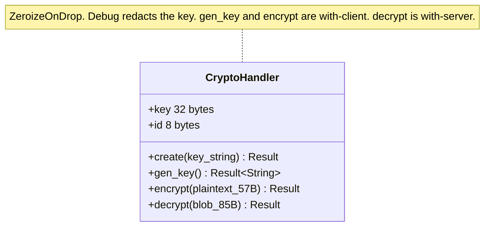

# common/crypto/

The cryptography module. Three files: `handler.rs` (the key type and its lifecycle),
`handler_ops.rs` (the AES-256-GCM-SIV encrypt/decrypt operations), and `mod.rs` (the free functions:
Blake2b hashing, Ed25519 verification, random ranges). The conceptual overview is in
[Cryptography](../architecture/cryptography.md); this is the file-by-file reference.



## handler.rs

Defines `CryptoHandler`, which owns the parsed key material and its lifecycle.

```rust
#[derive(ZeroizeOnDrop)]
pub(crate) struct CryptoHandler {
    pub(crate) key: [u8; 32],          // KEY_SIZE
    pub(crate) id:  [u8; 8],           // KEY_ID_SIZE
}
```

- **`create(key_string: &str) -> anyhow::Result<Self>`**: base64-decodes the (trimmed) key string
  into a `Zeroizing` buffer, splits off the first 8 bytes as the `id` and the remaining 32 as the
  `key`, and validates lengths. Errors with `"Key too short"` if fewer than 8 bytes, and
  `"Key length must be 32 bytes"` if the remainder is not exactly 32. Leading/trailing whitespace
  in the input is tolerated (the key is `trim`med), so a key copied with a trailing newline still
  works.
- **`gen_key() -> anyhow::Result<String>`** (`with-client`): generates 8 random id bytes and 32
  random key bytes with OpenSSL `rand_bytes`, concatenates them, and base64-encodes the result.
  This is the string surfaced by `ruroco-client gen` and the GUI Generate button.

Security hygiene baked into the type:

- **`ZeroizeOnDrop`**: the 32-byte key is wiped from memory when the handler is dropped.
- **Custom `Debug`**: prints `key: "<redacted>"`, so the secret never leaks into a log line or a
  panic message. A test asserts the raw key bytes never appear in the `Debug` output.

## handler_ops.rs

Adds the AES-256-GCM-SIV operations as feature-gated `impl CryptoHandler` blocks. Local constants:
`IV_SIZE = 12`, `TAG_SIZE = 16`.

### encrypt (with-client)

```rust
pub(crate) fn encrypt(&self, plaintext: &[u8; 57]) -> anyhow::Result<[u8; 85]>
```

1. Generates a fresh random 12-byte IV (`rand_bytes`).
2. Runs AES-256-GCM-SIV in encrypt mode over the 57-byte plaintext.
3. Asserts the produced ciphertext length equals `PLAINTEXT_SIZE` and that `finalize` emits 0
   extra bytes (GCM is a stream cipher mode, so the lengths match).
4. Reads the 16-byte authentication tag.
5. Returns the 85-byte blob laid out as `IV(12) || tag(16) || ciphertext(57)`.

Because the IV is random per call, encrypting identical plaintext twice yields different blobs (a
tested invariant). Plain GCM *requires* unique IVs for safety; AES-256-GCM-SIV is misuse-resistant,
so an accidental IV repeat only reveals whether two plaintexts were equal (rejected anyway by the
replay counter) rather than enabling key recovery, the random IV is defense in depth plus wire
indistinguishability.

### decrypt (with-server)

```rust
pub(crate) fn decrypt(&self, iv_tag_ciphertext: &[u8; 85]) -> anyhow::Result<[u8; 57]>
```

1. Splits the blob into IV `[0:12]`, tag `[12:28]`, ciphertext `[28:85]`.
2. Runs AES-256-GCM-SIV in decrypt mode.
3. Asserts the plaintext length equals `PLAINTEXT_SIZE`.
4. Sets the expected tag and calls `finalize`. If the tag does not verify (wrong key, tampering,
   truncation), `finalize` errors and the function returns `Err`. **It fails closed**: no plaintext
   is returned on any integrity failure.

A test confirms that decrypting with a different key returns an error.

## mod.rs

Houses the free cryptographic functions and declares the submodules.

### blake2b_u64

```rust
pub(crate) fn blake2b_u64(s: &str) -> anyhow::Result<u64>
```

Hashes a string with `Blake2bVar` configured for an 8-byte output, then interprets those 8 bytes
big-endian as a `u64`. This produces the `cmd_hash` carried in the packet. The client hashes the
command name to fill `ClientData`; the server (in the commander) hashes each configured command
name to find the match. Both sides agree without the name ever crossing the wire.

### verify_ed25519 (with-client)

```rust
pub(crate) fn verify_ed25519(
    public_key_pem: &[u8],
    message: &[u8],
    signature: &[u8],
) -> anyhow::Result<()>
```

Parses an Ed25519 public key from PEM, builds an OpenSSL `Verifier` with no pre-hash
(`new_without_digest`, correct for Ed25519), and verifies the detached signature over `message`.
Returns `Ok(())` only on a valid signature; otherwise it returns a descriptive error
(`"Could not parse Ed25519 public key"`, `"Signature verification failed"`, etc). Used exclusively
by the self-update path to authenticate downloaded binaries before they touch disk. Its tests cover
valid signatures, tampered messages, wrong keys, and malformed PEM.

### get_random_range

```rust
pub fn get_random_range(from: u16, to: u16) -> anyhow::Result<u16>
```

Returns a random `u16` in `[from, to)` using OpenSSL `rand_bytes` over 4 bytes and a modulo of the
span. This is the one `pub` (not `pub(crate)`) function in the module. It is used by
`fs::write_atomic` to pick a unique temp-file suffix and by the UI. It is a simple uniform-ish
helper, not a security-critical primitive.

## Gotchas

- `encrypt` is client-only and `decrypt` is server-only by feature gate, mirroring the one-way data
  flow. A binary that only sends never links the decrypt path and vice versa.
- The key string's `key_id` is **not** secret; only the 32-byte key is. Treat the whole base64
  string as a secret anyway, since it contains the key.
- Never log a `CryptoHandler` expecting to see the key: the `Debug` impl redacts it by design.
