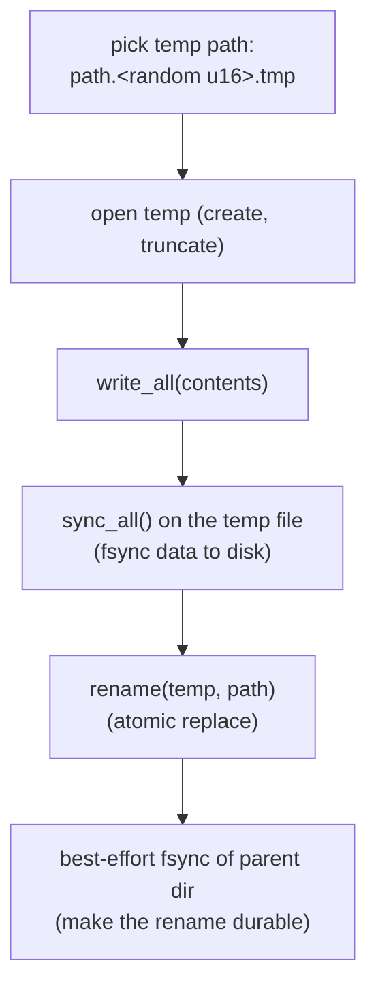

# fs.rs and logging.rs

Two small cross-cutting utility files in `common`. `fs.rs` provides durable, atomic file writes and
ownership/path helpers used wherever state is persisted. `logging.rs` is the project's own minimal
logger.

## fs.rs

### write_atomic (with-server or with-gui)

```rust
pub(crate) fn write_atomic(path: &Path, contents: &[u8]) -> anyhow::Result<()>
```

Writes a file atomically and durably, so a crash or power loss can never leave a half-written file.
This backs the replay counter, the server blocklist, and the GUI's saved-command list, all of which
must survive interruption intact.



The steps in order:

1. Build a unique temp path next to the target using `get_random_range(0, u16::MAX)` as a suffix.
2. Open it with create + write + truncate.
3. `write_all` the contents, then `sync_all()` to force the bytes to disk before the rename.
4. `rename` the temp over the target. On the same filesystem this is atomic: a reader sees either
   the entire old file or the entire new one, never a mix.
5. Best-effort `fsync` of the parent directory so the rename itself is durable across a crash. This
   step is allowed to fail silently (it is a durability nicety, not a correctness requirement).

A failure at the open or write stage returns a contextual error (the temp file is simply left
behind, never the corrupted target). Tests cover create, overwrite, and the nonexistent-parent
error path.

### resolve_path

```rust
pub(crate) fn resolve_path(path: &Path) -> PathBuf
```

Resolves a path to an absolute, canonicalized form. Absolute paths are returned unchanged.
Relative paths are joined onto the current directory and canonicalized. This function never
returns an error: if the current directory cannot be read, or canonicalization fails (for example
the path does not exist yet), it logs via `error(...)` and returns the best path it has. That
infallible-but-logged behavior is intentional, so callers that just need a usable path are not
forced into error handling for non-critical cases.

### change_file_ownership and helpers

```rust
pub(crate) fn change_file_ownership(path: &Path, user_name: &str, group_name: &str)
    -> anyhow::Result<()>
```

Changes a file's owner and/or group by name (using `nix` to resolve names to uid/gid, then
`std::os::unix::fs::chown`). An empty `user_name` or `group_name` means "leave that unchanged"
(passed to `chown` as `None`). Unknown user or group names produce a `"Could not find user/group"`
error; a `chown` failure (for example permission denied) produces a `"Could not change ownership"`
error. The private helpers `get_uid_by_name` and `get_gid_by_name` do the name-to-id lookup.

This is used by the server side to give the Unix socket and the installed binaries the right
ownership, and by the self-update path when replacing privileged binaries.

> Locale gotcha (from the project conventions): do not parse the output of `id` in tests; the
> system locale changes error message wording. The tests here assert on substrings of ruroco's own
> error messages, not on OS tool output.

## logging.rs

A deliberately tiny logger, with no external `log`/`tracing` crate dependency.

```rust
pub(crate) fn info(msg: impl std::fmt::Display)   // stdout, green "INFO"
pub(crate) fn error(msg: impl std::fmt::Display)  // stderr, red "ERROR"
```

- Both take `impl Display`, so callers pass an owned value: `info(format!("..."))` or
  `info("literal")`. The project convention is to **never** write `info(&format!(...))`: borrowing a
  temporary is unnecessary and reads worse.
- `info` prints to stdout, `error` to stderr, each prefixed with a UTC timestamp formatted as
  `%Y-%m-%dT%H:%M:%SZ` (via `chrono::Utc`) and an ANSI-colored level tag.
- There are no levels beyond info/error and no filtering. Output goes to the process's standard
  streams, which under systemd means it lands in the journal for both the server and commander
  services.

Keeping the logger this small is a deliberate choice for a security-sensitive daemon: less
dependency surface, predictable output, and no risk of a logging framework accidentally capturing
secrets (and recall that `CryptoHandler`'s `Debug` redacts the key in any case).
