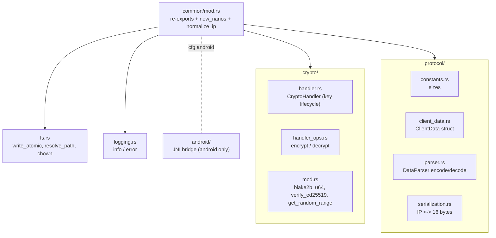

# Common Layer Overview

`src/common/` is the shared library compiled into every binary. It holds the code that the client
and server must agree on (cryptography and the wire protocol) plus cross-cutting utilities (atomic
file IO and logging). It is the only module not behind a feature gate: it always compiles, even
with `--no-default-features`.

## Layout



## What `mod.rs` itself provides

`src/common/mod.rs` wires the submodules together and re-exports the items used elsewhere. It also
defines two small but important helpers.

### `now_nanos`

```rust
pub(crate) fn now_nanos() -> anyhow::Result<u128>
```

Returns the current time as nanoseconds since the Unix epoch, as a `u128`. This single function is
the source of every counter value in the system: the client seeds and advances its replay counter
from it, and the server seeds its blocklist floor from it on startup. It returns an error (rather
than panicking) if the system clock is before the epoch.

### `normalize_ip` (server only)

```rust
#[cfg(feature = "with-server")]
pub(crate) fn normalize_ip(ip: IpAddr) -> IpAddr
```

Collapses an IPv6-mapped IPv4 address (for example `::ffff:192.168.0.1`) back to a plain IPv4
address, leaving genuine IPv6 and IPv4 addresses unchanged. Because every IP on the wire is stored
as 16 bytes (IPv6-mapped), this is how the server gets back a clean IPv4 value for comparison and
for `$RUROCO_IP`.

### Re-exports

`mod.rs` curates the crate-internal surface so the rest of the code does not reach deep into
submodules:

| Re-export | From | Used by |
| --- | --- | --- |
| `blake2b_u64` | `crypto` | client (build hash) and server (command lookup) |
| `get_random_range` | `crypto` | `fs::write_atomic` temp-name, UI |
| `crypto_handler` (alias for `crypto::handler`) | `crypto` | parser |
| `change_file_ownership`, `resolve_path` | `fs` | server, update, wizard |
| `info` | `logging` | everywhere |
| `client_data`, `data_parser` (alias for `protocol::parser`) | `protocol` | client, server |

## Feature gating inside common

Even though `common` always compiles, individual functions inside it are feature-gated so that, for
example, the server build does not pull in client-only code:

- `encrypt`, `verify_ed25519`, `ClientData::create` / `serialize`: `with-client`.
- `decrypt`, `ClientData::deserialize`, `is_source_ip_invalid`, `normalize_ip`,
  `deserialize_ip`: `with-server`.
- `write_atomic`: `with-server` or `with-gui` (the components that persist files).

The leaf chapters that follow document each file in full:

- [crypto/](./crypto.md): `CryptoHandler`, AES-256-GCM-SIV encrypt/decrypt, Blake2b-64, Ed25519.
- [protocol/](./protocol.md): the `ClientData` struct, sizes, parser, and IP serialization.
- [fs.rs and logging.rs](./fs-logging.md): atomic writes, path/ownership helpers, the logger.

The Android JNI bridge under `common/android/` is documented alongside the GUI it serves, in
[Android integration](../ui/android.md), because it only exists to back the UI on Android.
