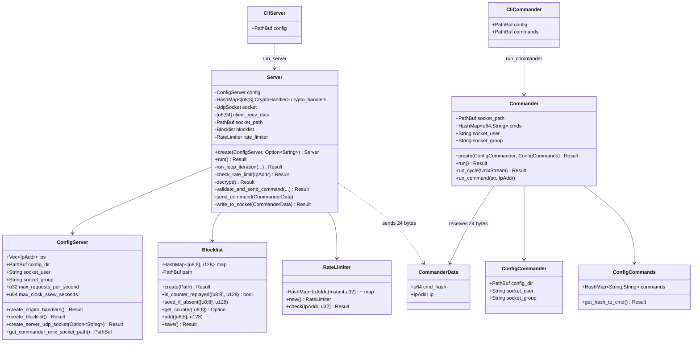
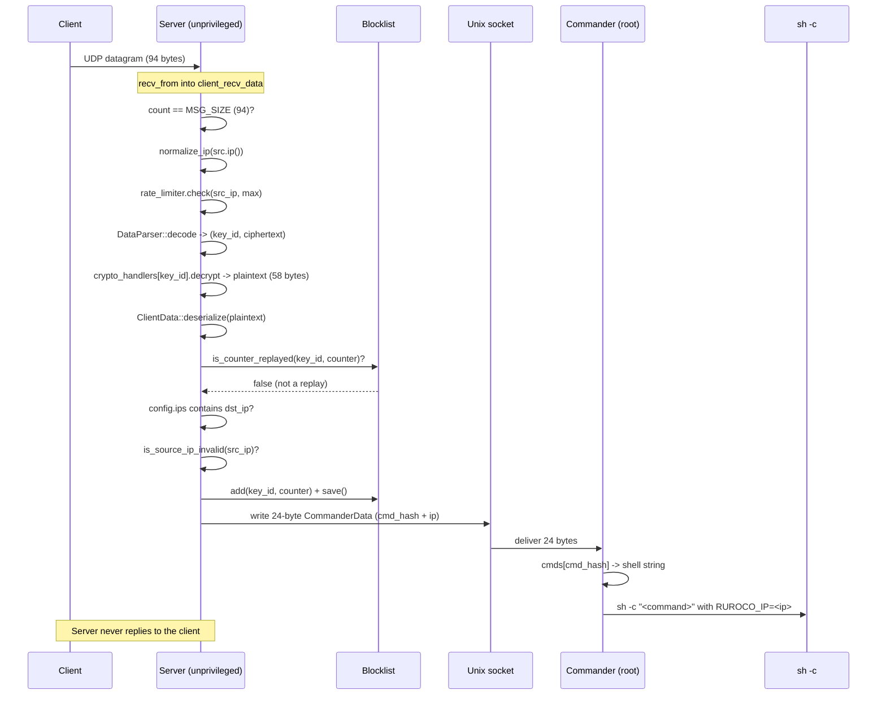
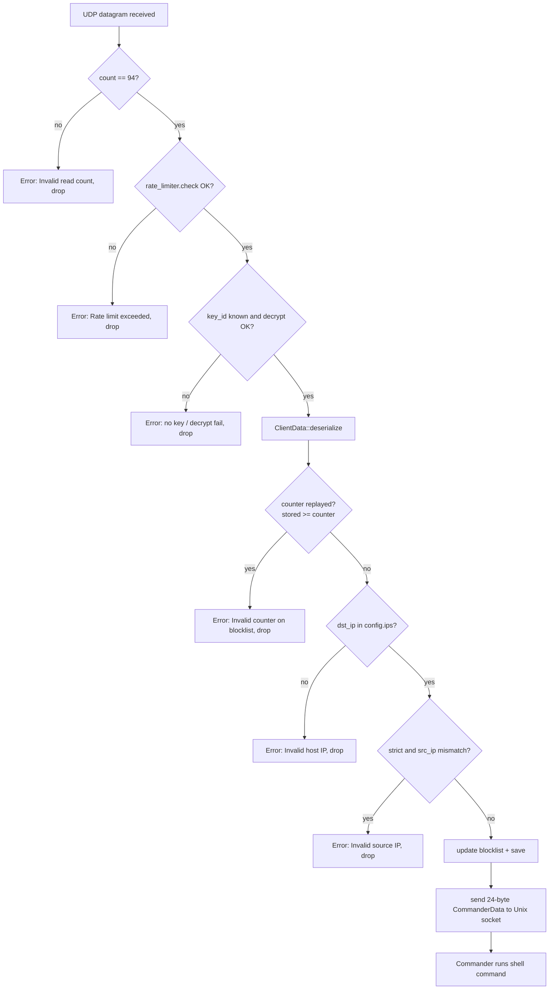

# Server and Commander Overview

Ruroco splits the receiving side of the system into two cooperating processes for privilege
separation:

- **Server** (`run_server`): an unprivileged daemon that owns the UDP socket. It receives the
  94-byte datagram, decrypts it, enforces rate limiting, deserializes the plaintext, and runs all
  validation (replay, destination IP, strict source IP). It never executes anything itself.
- **Commander** (`run_commander`): a privileged (typically root) process that owns the Unix domain
  socket. It receives a 24-byte `CommanderData` message from the server, looks the command up by
  its Blake2b-64 hash, and runs the configured shell command.

The two processes communicate over a single Unix domain socket (`ruroco.socket`). This is the only
boundary between them. The server can write to the socket, the commander reads from it. The server
never opens a privileged operation, and the commander never touches the network.

## The never-replies invariant

The protocol is strictly one-way. The server reads UDP datagrams but never sends a UDP response.
There is no acknowledgement, no error reply, and no status returned to the client. A client that
sends a packet learns nothing about whether it was accepted, rejected, rate limited, or replayed.
All outcomes (success and every failure) are logged locally on the server and surfaced as
`anyhow::Result` errors inside the receive loop, never transmitted back over the wire.

## Key invariants

- Server and Commander are separate processes (privilege separation via the Unix socket).
- The client never knows actual commands: it only sends a Blake2b-64 hash of the command name.
  The mapping from hash to shell string lives only in the commander's config.
- The counter is a u128 **nanosecond timestamp**, not a sequential value. Gaps between accepted
  counters are normal and expected.
- All IPs are stored and compared internally as IPv6-mapped (16 bytes); IPv4 addresses round-trip
  through `to_ipv6_mapped` on the wire and are collapsed back via `normalize_ip` on receipt.
- `CommanderData` on the Unix socket is exactly 24 bytes: `cmd_hash` (`u64`, big-endian) in
  bytes `[0:8]` and the IP (16 bytes, IPv6-mapped) in bytes `[8:24]`.

## Main types

`ConfigServer` / `CliServer` live in `server::config`; `Commander`, `ConfigCommander`,
`ConfigCommands`, and `CliCommander` live in the top-level `commander` module; the IPC type
`CommanderData` is the one shared piece, in `common::ipc`. `config.toml` is one file read by both
processes through their own views (`ConfigServer` vs `ConfigCommander`). The commander builds under
`with-commander` (no OpenSSL); `with-server` is a superset of it.

## Full valid request flow

## Validation decision tree

All `X*` outcomes are returned as `anyhow::Error` from `run_loop_iteration`, logged via `error(...)`,
and the loop continues. Nothing is sent back to the client in any case.

## Where to read next

- [Socket and signal handling](./socket-signal.md)
- [Handler and validation](./handler.md)
- [Blocklist and rate limiter](./blocklist-ratelimiter.md)
- [Config and keys](./config-keys.md)
- [IPC contract (ipc.rs)](../common/ipc.md)
- [Commander](../commander.md)
