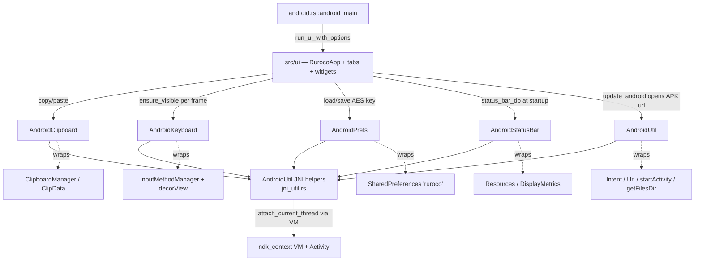

# Android JNI Bridge

On Android the GUI cannot use the desktop egui/filesystem paths for clipboard, soft keyboard,
status bar, or key storage. Instead it reaches into the Android platform through JNI. The bridge
lives in `src/common/android/` and the Android-specific GUI entry point in `src/ui/android.rs`.

All of this code is gated by `#![cfg(target_os = "android")]` and compiled under the
`android-build` feature; on desktop the modules do not exist and every call site is behind its own
`cfg`, so the desktop build no-ops these concerns (for example `DashboardState::load_persisted_key`
returns `""`, and `Widgets::copy_text` uses egui's clipboard).

## Architecture

Every JNI entry point follows the same pattern: grab the process's `AndroidContext` from
`ndk_context::android_context()`, reconstruct a `JavaVM` from its raw `vm()` pointer, attach the
current thread (`vm.attach_current_thread(|env| ...)`), wrap the activity `JObject` from
`ctx.context()`, then make JNI `call_method` / `call_static_method` / field reads. `AndroidUtil`
provides the shared call/string helpers; the rest are thin task-specific wrappers.



## `src/ui/android.rs`

```rust
#[no_mangle]
fn android_main(app: AndroidApp)
pub(crate) fn update_android() -> anyhow::Result<()>
```

`android_main` is the native-activity entry point (`#[no_mangle]`, called by
`android-activity`). It reads the status-bar inset via `AndroidStatusBar::height_dp()` (falling back
to `0.0`), builds `eframe::NativeOptions` with `android_app: Some(app)` and
`renderer: eframe::Renderer::Wgpu`, then calls `crate::ui::run_ui_with_options(opts, status_bar_dp)`.

`update_android` implements the Dashboard's Update action on Android: fetches the latest GitHub
release (`Updater::get_github_api_data(None)`), finds the asset whose name ends in `.apk`, then uses
`AndroidUtil` to `uri_parse` the download URL, build a `VIEW` intent (`new_view_intent`), and
`start_activity`. The `start_activity` error is logged as "probably expected" (handing off to the
browser may report a benign error), and the function still returns `Ok`.

## `src/common/android/mod.rs`

Declares the bridge submodules (`#![cfg(target_os = "android")]`) and re-exports the public façade:

```rust
pub(crate) use clipboard::AndroidClipboard;
pub(crate) use keyboard::AndroidKeyboard;
pub(crate) use prefs::AndroidPrefs;
pub(crate) use status_bar::AndroidStatusBar;
pub(crate) use util::AndroidUtil;
```

(`clipboard_read` and `keyboard_hide` add methods to the clipboard/keyboard types via `impl` blocks
and are not separately re-exported.)

## `src/common/android/util.rs` — `AndroidUtil`

```rust
pub(crate) struct AndroidUtil { ctx: Global<JObject<'static>>, vm: JavaVM }

impl AndroidUtil {
    pub(crate) fn create() -> anyhow::Result<AndroidUtil>
    pub(crate) fn get_conf_dir(&self) -> anyhow::Result<PathBuf>
    pub(crate) fn start_activity(&self, intent: &Global<JObject<'static>>) -> anyhow::Result<Global<JObject<'static>>>
    pub(crate) fn new_view_intent(&self, uri: &Global<JObject<'static>>) -> anyhow::Result<Global<JObject<'static>>>
    pub(crate) fn uri_parse(&self, url: String) -> anyhow::Result<Global<JObject<'static>>>
}
```

The only stateful bridge type: it caches a global ref to the activity context and the `JavaVM`.
`create` attaches the thread and builds a global ref of the activity. `get_conf_dir` resolves the
app's `getFilesDir().getAbsolutePath()` (where ruroco stores its config). The Intent helpers build a
`android.intent.action.VIEW` intent for a parsed `Uri`, adding `FLAG_ACTIVITY_NEW_TASK`
(`0x10000000`, required when launching from a non-Activity context), and start it. Constants
`J_STRING` / `J_FILE` hold common JNI return signatures.

## `src/common/android/jni_util.rs` — `AndroidUtil` JNI helpers

```rust
impl AndroidUtil {
    pub(crate) fn call_method_impl(env, obj, name, sig, args) -> anyhow::Result<Global<JObject<'static>>>
    pub(crate) fn call_static_method_impl(env, class, name, sig, args) -> anyhow::Result<Global<JObject<'static>>>
    pub(super) fn new_object_impl(env, class, sig, args) -> anyhow::Result<Global<JObject<'static>>>
    pub(crate) fn to_string_impl(env, global_ref) -> anyhow::Result<String>
    pub(super) fn unpack_result(result) -> anyhow::Result<JObject>
}
```

Reusable JNI primitives used by every other module:

- `call_method_impl` / `call_static_method_impl`: parse the method signature
  (`RuntimeMethodSignature::from_str`), invoke the (static) method, unpack the result object, and
  return a `Global` ref (so it survives leaving the JNI frame).
- `new_object_impl`: construct a new Java object and return a global ref.
- `to_string_impl`: casts a global ref to `JString` (`unsafe { as_cast_unchecked }`, relying on the
  caller having a real `java.lang.String`) and reads its MUTF-8 chars into a Rust `String`.
- `unpack_result`: turns a JNI call `Result` into a `JObject`, with context on each failure.

These wrappers return `anyhow::Result` with `.context(...)` on every fallible step, matching the
project's no-unwrap rule. The `unsafe` here is JNI FFI, scoped to raw pointer reconstruction and the
string cast.

## `src/common/android/clipboard.rs` + `clipboard_read.rs` — `AndroidClipboard`

```rust
pub(crate) struct AndroidClipboard;
impl AndroidClipboard {
    pub(crate) fn set_text(text: &str) -> anyhow::Result<()>   // clipboard.rs
    pub(crate) fn get_text() -> anyhow::Result<String>         // clipboard_read.rs
}
```

`set_text` obtains the `clipboard` system service (`ClipboardManager`), builds a
`ClipData.newPlainText("text", text)`, and calls `setPrimaryClip`. `get_text` obtains the same
service, calls `getPrimaryClip`, bails if null or `getItemCount() <= 0` ("Clipboard is empty"), then
reads item 0 via `getItemAt(0).coerceToText(activity).toString()`. The read path is split into its
own file (`clipboard_read.rs`) as a second `impl` block on the same struct.

## `src/common/android/keyboard.rs` + `keyboard_hide.rs` — `AndroidKeyboard`

```rust
pub(crate) struct AndroidKeyboard;
impl AndroidKeyboard {
    pub(crate) fn ensure_visible(want: bool) -> anyhow::Result<()>   // keyboard.rs
    fn show() -> anyhow::Result<()>                                  // keyboard.rs (private)
    pub(super) fn hide() -> anyhow::Result<()>                       // keyboard_hide.rs
}
```

Called every frame from `app_frame.rs` with `egui_wants_keyboard_input()`. A static
`AtomicBool KEYBOARD_HIDDEN` tracks state so `hide` is only invoked on a true->false transition
(otherwise the per-frame loop would fire ~60 JNI hide calls/sec). `show` is always called when
`want` is true: this re-shows the soft keyboard if the user dismissed it while a field stayed focused
(there is no transition to detect in that case).

- `show`: `getWindow().getDecorView()`, `requestFocus()`, then the `input_method` service
  (`InputMethodManager`) `showSoftInput(decorView, 0)`. Uses `InputMethodManager.showSoftInput`
  rather than the NDK `ANativeActivity_showSoftInput`, which is ignored on many devices.
- `hide`: gets the decor view's window token and calls
  `InputMethodManager.hideSoftInputFromWindow(token, 0)`.

## `src/common/android/prefs.rs` — `AndroidPrefs`

```rust
pub(crate) struct AndroidPrefs;
impl AndroidPrefs {
    pub(crate) fn get_string(key: &str) -> anyhow::Result<Option<String>>
    pub(crate) fn put_string(key: &str, value: &str) -> anyhow::Result<()>
}
```

Wraps `SharedPreferences` under the prefs file name `"ruroco"` in `MODE_PRIVATE` (`0`). This is how
the AES key persists across launches on Android (key `"aes_key"`, used by `DashboardState`).
`get_string` calls `getSharedPreferences(...).getString(key, "")` and maps an empty result to
`None`. `put_string` calls `getSharedPreferences(...).edit().putString(key, value)` then `apply()`.
The JNI method signatures are kept as module constants (`GET_PREFS_SIG`, `GET_STRING_SIG`,
`EDIT_SIG`, `PUT_STRING_SIG`).

## `src/common/android/status_bar.rs` — `AndroidStatusBar`

```rust
pub(crate) struct AndroidStatusBar;
impl AndroidStatusBar {
    pub(crate) fn height_dp() -> anyhow::Result<f32>
}
```

Returns the system status-bar height in dp (which equals egui logical points, so it can be fed
directly into `ui.add_space`). Reads `getResources().getDisplayMetrics().density`, looks up the
`android` `dimen` resource `status_bar_height` via `getIdentifier`, reads it with
`getDimensionPixelSize`, and divides by `density`. Returns `0.0` if density is non-positive or the
resource id is `0`. It reads a fixed system resource, so it is safe to call at startup with no
layout-timing concerns. The result flows `android_main -> run_ui_with_options -> RurocoApp.status_bar_dp`.

## Desktop no-op summary

| Bridge type | Android behavior | Desktop |
| --- | --- | --- |
| `AndroidClipboard` | JNI ClipboardManager | egui `ctx().copy_text` / `RequestPaste` |
| `AndroidKeyboard` | InputMethodManager show/hide | not called |
| `AndroidPrefs` | SharedPreferences `ruroco` | `load_persisted_key` returns `""`, `save_key` skips persist |
| `AndroidStatusBar` | reads `status_bar_height` dimen | `status_bar_dp = 0.0` |
| `AndroidUtil` | Intent/Uri/files dir | desktop uses `client::update::Updater` and the normal config dir |
