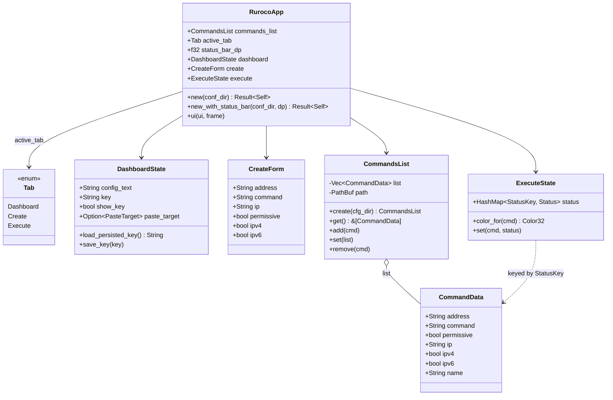
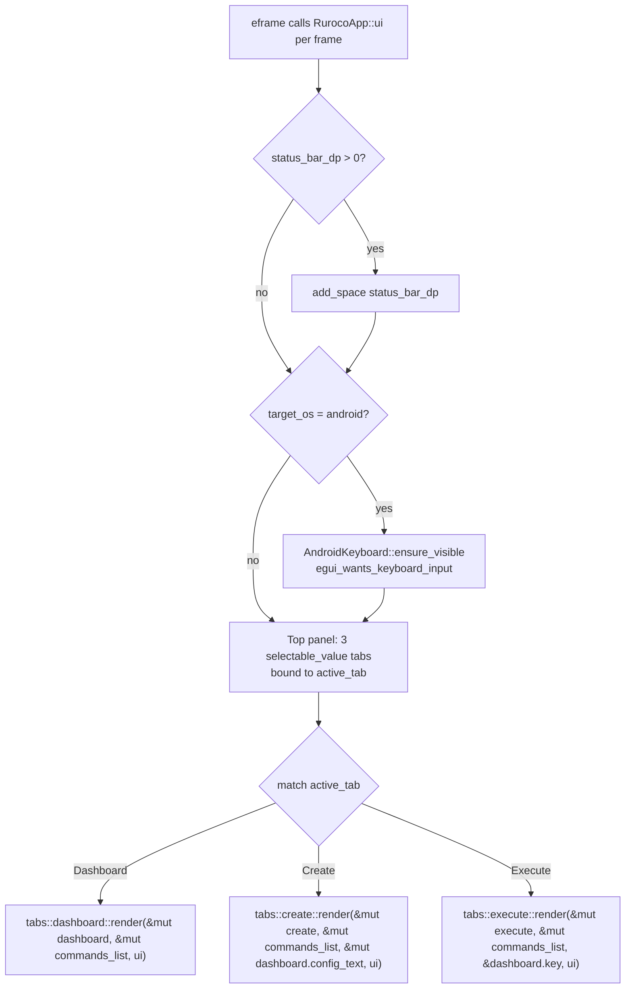

# GUI Overview

The ruroco GUI is an [egui](https://github.com/emilk/egui) application built on
[eframe](https://docs.rs/eframe). It is a thin **view layer** over `src/client/`: when the user
runs a saved command, the GUI builds a `send` CLI invocation and calls the client's send path
directly. There is no separate networking layer in the UI. A slow or blocking send blocks the UI
thread (see [Execute tab](tabs.md)).

The same code base runs on the desktop (Linux) and on Android. The platform differences (clipboard,
soft keyboard, status-bar inset, AES-key persistence) are localized behind `cfg(target_os = ...)`
branches and the `src/common/android` JNI bridge (see [Android bridge](android.md)).

## Entry points (`src/ui/mod.rs`)

The module declares the GUI submodules. `android` is compiled only under `cfg(target_os = "android")`.

```rust
fn set_font_size(ctx: &eframe::egui::Context, size: f32)
pub fn run_ui() -> Result<(), Box<dyn Error>>
#[cfg(target_os = "android")]
pub fn run_ui_with_options(opts: eframe::NativeOptions, status_bar_dp: f32) -> Result<(), Box<dyn Error>>
```

- `set_font_size`: clones the global egui style, sets every text style's size, and writes the style
  back. Called with `14.0` on both platforms during app construction.
- `run_ui` (desktop): resolves the config dir via `config::get_conf_dir()`, acquires a
  `ClientLock` on `<conf_dir>/client.lock` (held for the process lifetime via `_lock`), then opens
  an `eframe` native window (inner size `540x1200`, title `ruroco`) and constructs
  `RurocoApp::new(&conf_dir)`.
- `run_ui_with_options` (Android only): same lock + construction, but takes a caller-supplied
  `NativeOptions` (wgpu renderer + the `AndroidApp` handle) and a `status_bar_dp` inset height,
  constructing the app via `RurocoApp::new_with_status_bar(&conf_dir, status_bar_dp)`.

## The frame-loop model

`RurocoApp` implements `eframe::App` (in `app_frame.rs`). eframe calls into the app once per frame
(immediate-mode GUI: the whole UI is rebuilt every frame, typically ~60 fps). All UI state lives on
`RurocoApp` and persists across frames and across tab switches; nothing is reset when a tab is
re-entered. This is deliberate, to support multi-step workflows (for example, generate a key on the
Dashboard, then run a command on Execute).

Each frame:

1. Reserve the Android status-bar inset (`add_space(status_bar_dp)`) if non-zero.
2. On Android only, keep the soft keyboard in sync with `egui_wants_keyboard_input()`.
3. Draw the top tab bar (three `selectable_value` toggles bound to `active_tab`).
4. Dispatch to the active tab's `render` function in a `CentralPanel`.

## Desktop vs Android

| Concern | Desktop | Android |
| --- | --- | --- |
| Entry point | `run_ui()` (native window) | `android_main` -> `run_ui_with_options()` (wgpu / native-activity) |
| Clipboard copy | `ui.ctx().copy_text(...)` | `AndroidClipboard::set_text` (JNI) |
| Clipboard paste | `ViewportCommand::RequestPaste` event, handled next frame | `AndroidClipboard::get_text` (JNI), applied immediately |
| AES key persistence | not persisted (`load_persisted_key` returns `""`) | `AndroidPrefs` SharedPreferences (`ruroco`/`aes_key`) |
| Soft keyboard | n/a | `AndroidKeyboard::ensure_visible` per frame |
| Status-bar inset | `0.0` | `AndroidStatusBar::height_dp()` |
| Update action | `client::update::Updater` | `update_android()` opens the APK download URL via an Intent |

## Component model



## Frame loop and tab dispatch (`app_frame.rs`)



Note that the trait method is named `ui(&mut self, ui, _frame)`, not the more usual eframe
`update`; it receives a `&mut egui::Ui` directly and draws a top panel plus a central panel inside
it.
