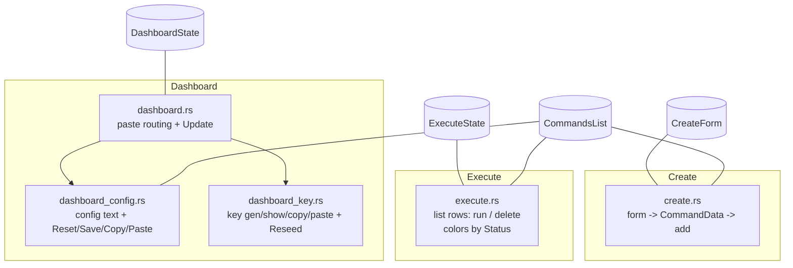

# Tabs

The three tabs are plain functions, each taking its own mutable state plus shared resources, and
each dispatched from `app_frame.rs`. There is no tab trait: a tab is just a `render(...)` function
declared in `tabs/mod.rs`.



## `src/ui/tabs/mod.rs`

Declares the tab and widget submodules, all `pub(crate)`:

```rust
pub(crate) mod create;
pub(crate) mod dashboard;
pub(crate) mod dashboard_config;
pub(crate) mod dashboard_key;
pub(crate) mod execute;
pub(crate) mod widgets;
```

## Dashboard

The Dashboard manages the AES key and the saved-command-list config. It is split across three files:
`dashboard.rs` (layout + paste routing + Update), `dashboard_config.rs` (config text area),
`dashboard_key.rs` (key controls + counter reseed).

### `src/ui/tabs/dashboard.rs`

```rust
pub(crate) fn render(dashboard: &mut DashboardState, commands_list: &mut CommandsList, ui: &mut egui::Ui)
```

Responsibilities:

1. **Desktop paste completion.** Scans this frame's input events for an `egui::Event::Paste(text)`.
   If `dashboard.paste_target` is set (a paste was requested last frame), the pasted text is routed:
   `PasteTarget::Key` -> `dashboard.save_key(text)`, `PasteTarget::Config` ->
   `dashboard.config_text = text`. `paste_target` is consumed with `take()`.
2. Renders the config sub-view (`dashboard_config::render`, given `available_height() * 0.45`), a
   separator, then the key sub-view (`dashboard_key::render`).
3. A bottom-anchored full-width **Update Application** button. On Linux it runs
   `Updater::create(false, None, None, false).and_then(|u| u.update())`; on Android it calls
   `update_android()` (see [Android bridge](android.md)). Errors are logged, not surfaced in the UI.

### `src/ui/tabs/dashboard_config.rs`

```rust
pub(crate) fn render(dashboard: &mut DashboardState, commands_list: &mut CommandsList, ui: &mut egui::Ui, config_height: f32)
```

A scrollable monospace multi-line `TextEdit` bound to `dashboard.config_text`, capped at
`config_height`, followed by four equal-width buttons (`["Reset", "💾", "📋", "📥"]`):

- **Reset**: `config_text = commands_list.to_string()` (discard edits).
- **💾 Save**: parse each line with `command_to_data`, `commands_list.set(cmds)` (auto-saves to
  disk), then re-render `config_text` from the now-normalized/sorted list.
- **📋 Copy**: `copy_text(config_text)` (platform clipboard).
- **📥 Paste**: `paste_button(dashboard, PasteTarget::Config)` (see widgets; desktop defers, Android
  applies immediately).

### `src/ui/tabs/dashboard_key.rs`

```rust
pub(crate) fn render(dashboard: &mut DashboardState, ui: &mut egui::Ui)
```

A single-line key `TextEdit` (password-masked unless `show_key`), then four equal-width buttons
(`["Generate", lock_label, "📋", "📥"]` where `lock_label` is `"🔒"` when shown, `"🔓"` when hidden):

- **Generate**: `CryptoHandler::gen_key()`; on success `dashboard.save_key(k)` (persists on Android),
  on error logs.
- **lock toggle**: flips `dashboard.show_key`.
- **📋 Copy**: `copy_text(dashboard.key)`.
- **📥 Paste**: `paste_button(dashboard, PasteTarget::Key)`.

Below a separator, a full-width **Reseed Counter** button: resolves `Sender::get_counter_path()`,
then `now_nanos()` and `Counter::reseed(path, value)`, logging success/failure. This rewrites the
client's replay counter seed.

## `src/ui/tabs/create.rs`

```rust
pub(crate) fn render(form: &mut CreateForm, commands_list: &mut CommandsList, config_text: &mut String, ui: &mut egui::Ui)
```

A scrollable form to build one `CommandData`. Rows: `server` (address), `command`,
`ip sent to server`, and checkboxes for `permissive`, `ipv4`, `ipv6`. Layout helpers `arg_row` and
`arg_row_text` split each row into a wrapped label (left half) and the widget (right half).

The full-width **Add Command** button builds a `CommandData` from the form, runs it through
`add_command_name` (to populate the display `name`), then `commands_list.add(cmd)` (auto-saves and
sorts). It refreshes `*config_text = commands_list.to_string()` and clears the form (address, ip,
and the three booleans; `command` is left as-is).

## `src/ui/tabs/execute.rs`

```rust
pub(crate) fn render(state: &mut ExecuteState, commands_list: &mut CommandsList, key: &str, ui: &mut egui::Ui)
fn exec_command(state: &mut ExecuteState, key: &str, cmd: CommandData)  // private
```

Lists the saved commands (a `to_vec()` snapshot taken before the loop so the list can be mutated
inside it). Each row:

- A blue ▶ **run** `icon_button` on the left.
- A right-to-left layout with a red 🗑 **delete** `icon_button` anchored right and the command name
  in a bordered box whose stroke color comes from `state.color_for(cmd)` (gray = not run, green =
  last run ok, red = last run failed).

Deferred mutation: clicks set `to_delete` / `to_exec` locals; after the loop, delete removes the
command from both `state.status` (by `StatusKey`) and `commands_list` (auto-saves), and run calls
`exec_command`.

`exec_command` is the bridge to the client. It logs, trims the key (empty key -> `None`), builds a
`send ...` string via `data_to_command(&cmd, key_opt)`, splits it on whitespace, prepends `"ruroco"`,
parses it into `CliClient` with `CliClient::try_parse_from`, and runs `run_client_send`. This is the
client's real send path, called **synchronously on the UI thread**: a slow send blocks rendering.
On success it records `Status::Ok`; on error it logs and records `Status::Err`. There is no async,
spinner, or response (the protocol is one-way).
